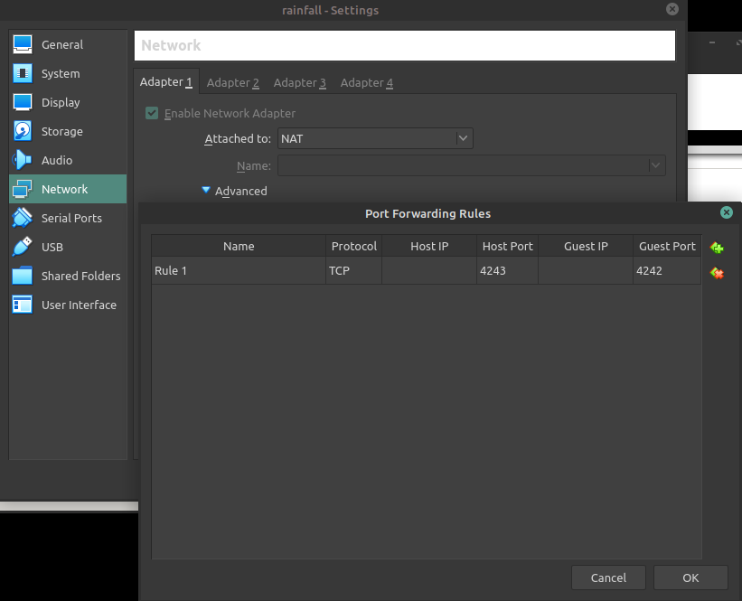
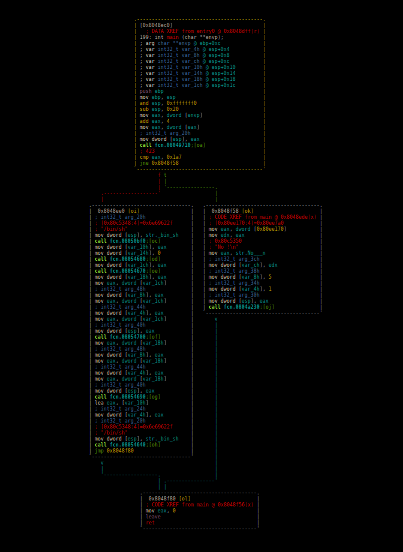
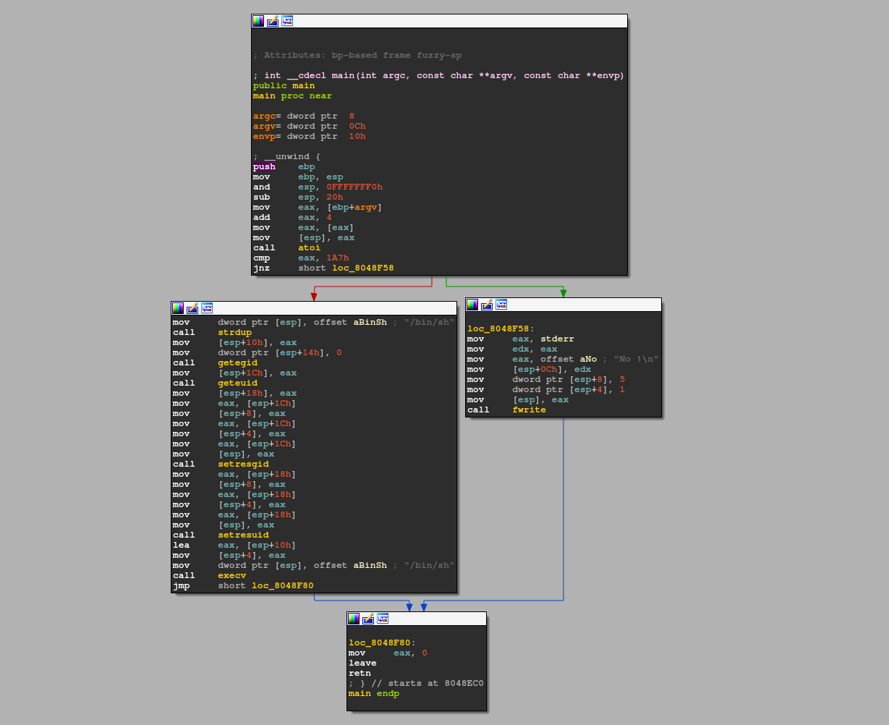

# Level 0

## Setup
We find a binary file at the root of the user **`level0`** named *`./level0`*.

To analyze the binary file we copy it to our own environment with `scp` *(OpenSSH secure file copy)*.
```bash
scp -r -P 4243 level0@localhost:/home/user/level0/level0 .
```
> [!NOTE]  
> When forwarding the ssh port *(4242)* from the Rainfall VM. 4242 Is occupied on the Host machine at 42, so we have to choose another port *(4243 for example)*.
> 

To see what kind of file we have in possesion, we can run:
```bash
$ file ./level0
level0: ELF 32-bit LSB executable, Intel 80386, version 1 (GNU/Linux), statically linked, for GNU/Linux 2.6.24, BuildID[sha1]=2440cf857c9ce7dbe7304fcf56a301c612f404ce, stripped
```
We can see that *`./level0`* is a statically linked ELF executable file, so we can try to reverse engineer it with radare2 *(r2)* or with another tool for this purpose.

I am running `r2` inside docker.
```bash
docker run -it -v "$bin_file_path":/mnt/binary radare/radare2 bash -c "r2 /mnt/binary"
```

## Binary Analysis

On the `r2` prompt we need to run a couple of commands to analyze the `main` function.
```bash
[0x08048de8]> aaa #Automatically analyze the binary
...
[0x08048de8]> s main #Seek to the main function
[0x08048ec0]> V #Enter visual mode
[0x08048ec0]> V
```

