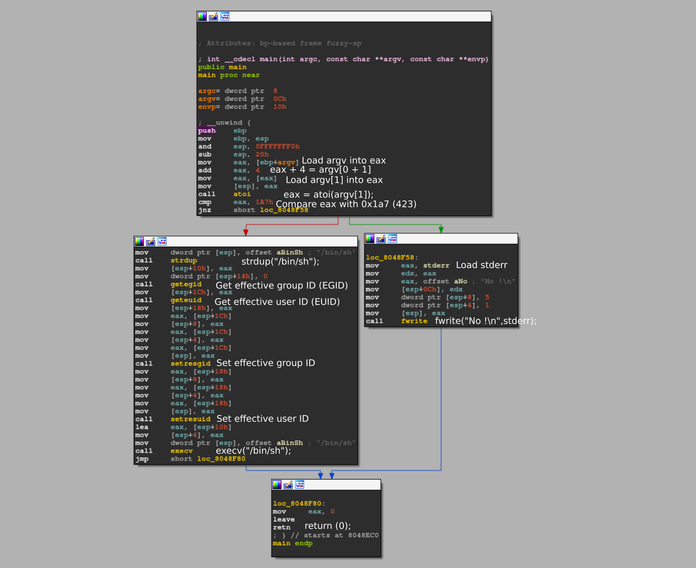

# Level 0

## Setup
We find a binary file at the root of the user **`level0`** named *`./level0`*.

To analyze the binary file we copy it to our own environment with `scp` *(OpenSSH secure file copy)*.
```bash
scp -r -P 4243 level0@localhost:/home/user/level0/level0 .
```
> [!NOTE]  
> When forwarding the ssh port *(4242)* from the Rainfall VM. 4242 Is occupied on the Host machine at 42, so we have to choose another port *(4243 for example)*.
> 
> 

To see what kind of file we have in possesion, we can run:
```bash
$ file ./level0
level0: ELF 32-bit LSB executable, Intel 80386, version 1 (GNU/Linux), statically linked, for GNU/Linux 2.6.24, BuildID[sha1]=2440cf857c9ce7dbe7304fcf56a301c612f404ce, stripped
```
We can see that *`./level0`* is a statically linked ELF executable file, so we can try to reverse engineer it with radare2 *(r2)* or with another tool for this purpose.

### Radare2

I am running `r2` inside docker.
```bash
docker run -it -v "$bin_file_path":/mnt/binary radare/radare2 bash -c "r2 /mnt/binary"
```

## Binary Analysis

On the `r2` prompt we need to run a couple of commands to analyze the `main` function.
```bash
[0x08048de8]> aaa #Automatically analyze the binary
...
[0x08048de8]> s main #Seek to the main function
[0x08048ec0]> V #Enter visual mode
[0x08048ec0]> V
```
<p align="center">
   
</p>

## Reverse Engineer
### Permissions
```bash
level0@RainFall:~$ ls -l
total 732
-rwsr-x---+ 1 level1 users 747441 Mar  6  2016 level0

```
The permissions `-rwsr-x---+` indicate that the binary `./level0` has the setuid `(s)` permission set for the user *(owner)*. This means that when the `./level0` binary is executed *(by any user)*, it runs with the privileges of the user **level1**, the owner of the file.

### Code

<p align="center">
   
</p>

We can see in the code that the program is calling `atoi(argv[1])` on the first argument sent to `./level0 <arg>` and comparing it to the number *423*.
Then if the argument is the same number, the program sets the *EGID* and *EUID* in order to execute `execv("/bin/sh")` with the privileges of the file owner instead of the privileges of the user who executed it. 
This opens a shell as the user **level1** and allow us to `cat` the content of the `.pass` file.

## Solution

```bash
$ cat /home/user/level1/.pass
1fe8a524fa4bec01ca4ea2a869af2a02260d4a7d5fe7e7c24d8617e6dca12d3a
```

## Source

The equivalent program in C would be:
```C
#include <stdio.h>
#include <stdlib.h>
#include <string.h>
#include <unistd.h>

int main(int argc, const char **argv, const char **envp)
{
    if (argc < 423)
    {
        // Write "No !" to stderr
        fwrite("No !\n", sizeof(char), 5, stderr);
    } 
    else 
    {
        // Execute /bin/sh
        char *shell_cmd = strdup("/bin/sh");
        setresgid(getegid(), getegid(), getegid());
        setresuid(geteuid(), geteuid(), geteuid());
        execv(shell_cmd, argv);
    }
    return (0);
}
```
